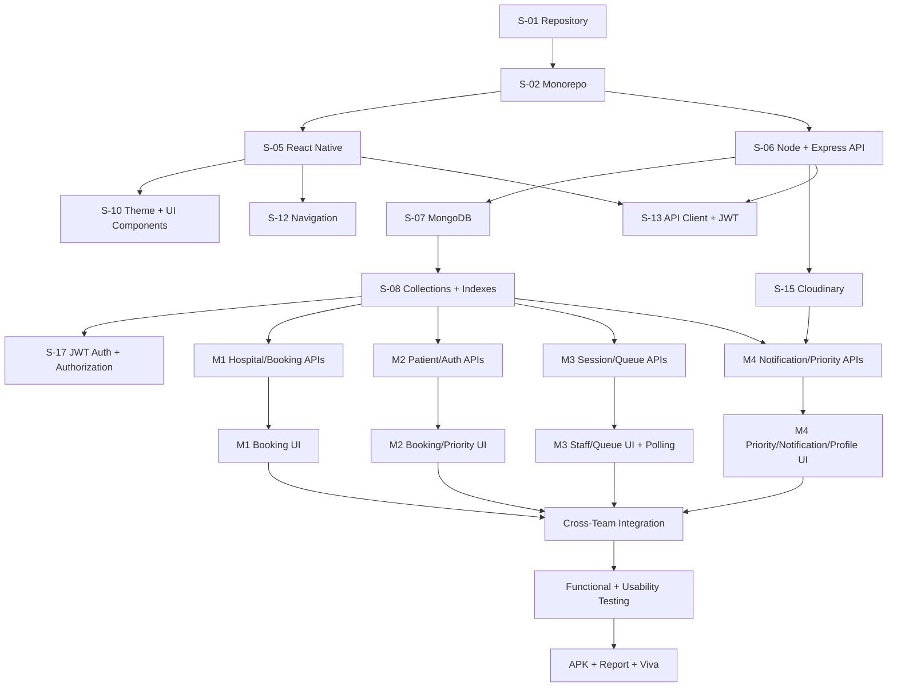
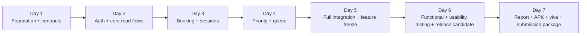

# Government Hospital OPD Booking & Queue Management System

> **Development Master Plan — React Native + Node.js**  
> **Group:** WE_85  
> **Course context:** IT3060 Human Computer Interaction, Year 3 Semester 2, 2026  
> **Prepared from:** Milestone 01, Milestone 02, **Milestone 03 assignment brief**, and the provided high-fidelity HTML prototype  
> **Purpose:** One source of truth for project structure, feature ownership, task dependencies, Milestone 03 compliance, CRUD evidence, implementation order, testing, integration, report/viva preparation, and delivery.
> **Delivery constraint:** The complete implementation/evaluation window used by the group is **7 calendar days**. The plan below is therefore organized around a strict P0 MVP, parallel ownership, daily integration, and a Day 7 release freeze.  
> **Milestone 03:** Mobile App Implementation & Final Evaluation. Official assignment deadline: **09 October 2026**. The 7-day internal target intentionally finishes before the official deadline to leave contingency time for submission problems.

> **FINAL TECHNOLOGY STACK — LOCKED:** This project must be implemented using **React Native** for the mobile frontend, **Node.js + Express** for the backend/API, **MongoDB** for persistent data, **JWT** for authentication/authorization, and **Cloudinary** for image/media storage. **Do not introduce any other external platform/service into the project.** Supporting npm packages may be used only as implementation libraries; they must not replace or add to the agreed service stack.

---

## Local Mobile Setup — S-05

The team has selected **React Native with Expo Go** for mobile development. Expo is the frontend development tool; Node.js/Express, MongoDB, JWT, and Cloudinary remain the application service stack. See [mobile setup and verification](apps/mobile/README.md).

From the repository root:

```bash
npm install
npm run dev:mobile
```

Install an Expo Go build compatible with SDK 57 on your phone, connect it to the same network as your computer, and scan the terminal QR code. Android Studio and Xcode are not required for this phone workflow. Dependencies are installed and the initial Expo Go phone launch has been confirmed (S-05). Member 1’s navigation scaffold (S-12) is implemented and locally tested; see [navigation handoff and phone checks](docs/NAVIGATION.md). Splash and Welcome now have dedicated screens with tested startup/recovery behavior; see [Member 1 startup handoff](docs/STARTUP.md). Patient Home now has its frontend, quick actions, and next-appointment API adapter; see [Patient Home handoff](docs/PATIENT_HOME.md). Real authentication, live booking data, and prototype comparison remain pending.

## Local API Setup — M1-04

Express startup, MongoDB connectivity, hospital search, and standard errors are implemented. With MongoDB running locally, execute these commands from the **QueueCare repository root** (copy the environment example only on first setup):

```bash
cp apps/api/.env.example apps/api/.env
npm run db:seed:hospitals
npm run dev:api
```

The seed adds three fictional demo hospitals without replacing existing data. The search endpoint is `http://localhost:4000/api/v1/hospitals`; `http://localhost:4000/health` checks database connectivity. See [API prerequisites, configuration, and tests](apps/api/README.md). M1-05's Hospital Search screen and M1-07's Hospital Details screen now consume the public discovery APIs. Configure the mobile API URL and follow [Hospital Search phone checks](docs/HOSPITAL_SEARCH.md). M1-06 provides `/api/v1/hospitals/:hospitalId` and `/api/v1/hospitals/:hospitalId/services`. Run `npm run db:seed:discovery` to add demo hospitals and services; see [Hospital Details setup and phone checks](docs/HOSPITAL_DETAILS.md). M1-08 provides `/api/v1/hospitals/:hospitalId/sessions` with date/service filters and remaining capacity. Run `npm run db:seed:sessions` for tomorrow’s demo sessions; see [session setup and handoff](docs/SESSIONS.md). M1-09’s [Book Appointment screen](docs/BOOK_APPOINTMENT.md) now supports date selection, capacity, single-session selection, and a patient-summary handoff. Member 1’s next task is **M1-10, the transactional create-booking API**, depending on authenticated patient middleware. Real authentication/profile loading, booking confirmation, and actual opening hours remain pending. See [current project progress](docs/DEVELOPMENT_PLAN.md).

## 1. Project Overview

The project is a digital **Appointment Booking and Queue Management System for Government Hospital OPDs**. The application is intended to reduce manual registration, long waiting times, overcrowding, unclear queue status, repeated questions to reception staff, and difficulty supporting priority patients.

The implementation should provide two connected experiences:

1. **Patient mobile experience** — account creation, sign-in, hospital discovery, appointment booking, booking management, priority queue requests, request status, notifications, and profile management.
2. **Hospital staff / reception experience** — staff sign-in/registration, dashboard, OPD session management, priority request review, patient/queue visibility, notifications, and queue operations.

The Milestone 01 requirements also mention doctor and administrator capabilities. However, the supplied high-fidelity screens focus on patients and reception/hospital staff. This document therefore separates the build into:

- **Core Scope:** directly supported by the final high-fidelity screens and Milestone 02 flows.
- **Requirements Gap / Extension Scope:** required or suggested in Milestone 01 but not represented by final high-fidelity screens.

---

## 2. Source-of-Truth Rules

When documents differ, use this priority order:

1. **High-fidelity HTML screens** — final UI appearance, labels, visible states, navigation, and screen-level behavior.
2. **Milestone 02** — member ownership, final interaction flows, and usability findings.
3. **Milestone 01** — underlying functional requirements, non-functional requirements, user stories, and research needs.
4. **This development plan** — implementation-level technical decisions added to make the design buildable.

### Important known gaps

- Milestone 01 includes **doctor functions (FR-20 to FR-23)**, but there are no doctor high-fidelity screens.
- Milestone 01 includes an **administrator role**, but there is no administrator dashboard prototype.
- Milestone 01 NFR-08 specifies support for modern web browsers. The agreed implementation is a **React Native mobile application**, so browser support is outside this stack. Confirm with the lecturer that mobile-only delivery is acceptable and document this as a justified scope deviation if required.
- The final prototype does not show a dedicated patient **check-in / live queue screen**, although Milestone 01 requires queue number, queue position, estimated waiting time, and real-time updates. These must be implemented either inside Booking Details / Home or as an additional approved screen.
- Staff account approval is mentioned, but there is no administrator approval UI. For the academic MVP, use a seeded administrator or controlled backend endpoint unless an admin UI is later designed.

---

## 2.1 Milestone 03 — Assignment Compliance Requirements

Milestone 03 changes this project from a prototype exercise into a **working mobile application implementation and final evaluation**. The build must therefore be treated as an assessed software release, not as another clickable prototype.

### Official Milestone 03 objective

Implement a working mobile application based on the Milestone 02 high-fidelity prototype, use a justified technology stack, and validate the working application through functional and usability testing.

### Non-negotiable assignment requirements

| Assignment requirement | What this project plan must do | Evidence to keep |
|---|---|---|
| Working installable/runnable mobile app | Build the React Native app against the real Node.js backend and database. No screen in the assessed flow may be a prototype-only image or dead button. | APK/installable build, demo recording/screenshots, release tag |
| Continue with same 4-member group | Preserve the Milestone 02 feature ownership and make each member able to explain their own implementation. | Git history, workload table, viva script |
| Each member implements their assigned interfaces | Every member owns frontend + backend/data integration + tests for their vertical slice. | PRs/commits, screenshots, test cases |
| At least 2 working CRUD operations per interface/workload | Track CRUD/data operations explicitly and demonstrate at least two meaningful operations for every data-driven assessed interface. Static routing screens are documented as non-data screens; lecturer clarification should be obtained if the wording is interpreted literally for Splash/Welcome/Role Selection. | CRUD matrix, API logs, DB before/after evidence, test cases |
| Match Milestone 02 high-fidelity prototype | Keep structure, intent, labels, visual hierarchy, and user flow aligned with the high-fidelity screens. | Side-by-side screenshot evidence |
| Document deviations | Any necessary UI/flow/technical change must be logged with reason and impact. | `docs/milestone03/DEVIATIONS.md` and final report table |
| Functional test cases for core features and CRUD | Write, execute, and record pass/fail results for all core flows and CRUD operations. | Test-case spreadsheet/Markdown, screenshots/logs |
| Traceability matrix required | Link requirement -> prototype screen -> implementation task/screen/API -> test case -> result. | Final traceability matrix |
| Minimum 5 usability-test participants | Test the **working app**, not the prototype, with at least 5 real/proxy users. | Participant codes, consent/brief, tasks, observations, results |
| Analyse defects/usability issues and fixes | Every issue gets severity, evidence, owner, fix/planned action, and retest status. | Issue log + before/after screenshots |
| Version-controlled repository | Keep source in GitHub (or equivalent) with meaningful commits and a clear README. | Repository link, commit history |
| README with setup/run instructions | A new team member/examiner must be able to build/run the app using the README. | `README.md`, `.env.example`, seed instructions |
| Consolidated report for Milestones 01–03 | Produce one coherent final report, maximum 35 pages including cover page, excluding references/appendix as specified. | Final PDF |
| Installable build | Produce APK where applicable and test it on a physical Android device. | APK + device test evidence |
| Live demonstration/viva | Each member must individually demonstrate and explain their interfaces, stack decisions, testing and contribution. | Member-specific demo script and viva notes |

### Milestone 03 report/submission facts

- Assignment title: **Mobile App Implementation & Final Evaluation**.
- Published: **28.09.2026**.
- Official deadline: **09.10.2026**.
- Submission mode: **Online**.
- Final report filename: `IT3060HCI2026_Milestone03_GroupWE_85.pdf`.
- Consolidated report maximum: **35 pages including the cover page**.
- References are not counted in the page limit.
- Appendix is not counted in the page limit and should hold full test logs, extra screenshots, recordings/links, selected source excerpts, and raw evidence.

### Marking-priority rule

The Milestone 03 marking scheme places the greatest emphasis on the implemented application and its fidelity, followed by testing. The 7-day sprint should therefore allocate effort in this order:

| Rubric area | Marks shown in brief | Sprint implication |
|---|---:|---|
| Implementation & Fidelity | 8 | Highest priority: complete, working core flows and correct CRUD/data behavior |
| Testing — Functional & Usability | 5 | Do not leave testing to the final hours; functional tests and 5-user usability testing are required |
| Consolidated Report & Demonstration/Viva | 4 | Evidence must be collected during development, not recreated on Day 7 |
| Tech Stack Selection & Justification | 3 | Finalize the stack on Day 1 and document why it fits the project constraints |

### Source-code originality rule

The submitted implementation must be the group's own work. AI may be used as an aid, but team members must understand, adapt, test, and be able to explain every submitted section during the viva. Avoid copying generated text or code blindly; retain meaningful Git history showing the group's actual implementation process.

---

## 3. Team Ownership

The development ownership follows the distribution already used in Milestone 02 so that each member continues with the area they designed.

| Member | Student ID | Primary Development Ownership |
|---|---|---|
| **Member 1 — Dayarathna A A D N** | IT23681088 | Hospital discovery, hospital details, OPD session discovery, appointment booking, confirmation, project coordination |
| **Member 2 — Perera K N T** | IT23686038 | Patient account flow, My Bookings, Booking Details, patient priority request, request status |
| **Member 3 — Shaveena K W K** | IT23682146 | Role selection, staff sign-in, receptionist dashboard, OPD session management, live queue/session metrics |
| **Member 4 — Rajarathna P E G** | IT23673922 | Staff registration/verification, priority request management, notifications, profile, traceability/testing documentation |

### Ownership principle

Each member owns a **vertical slice** rather than frontend-only or backend-only work. For their feature area, the owner is responsible for:

- React Native screens and components
- API endpoints required by those screens
- Service/business logic
- Database access for their feature
- Unit/integration tests
- Error/loading/empty states
- API integration and final demo flow

Shared infrastructure is completed collaboratively before feature development begins.

### 3.1 Seven-Day Delivery Rules

Because the implementation must be finished in **7 days**, all four members work in parallel from Day 1 and merge working code every day.

**P0 — must be working by the end of Day 5:**

- Patient registration/sign-in and staff sign-in using JWT
- Hospital search/details/session discovery from MongoDB
- Appointment booking + booking confirmation
- My Bookings + Booking Details + cancel booking
- Patient priority request + request status
- Reception dashboard + OPD session list + Add/Edit Session
- Staff priority inbox + Request Details + Accept/Decline
- Basic check-in/queue number + current queue position/waiting count
- In-app notifications stored in MongoDB
- Profile and logout
- Profile/photo upload to Cloudinary where the interface requires an image
- All navigation paths shown in the high-fidelity prototype
- High-priority usability fix: live patients-waiting count

**P1 — implement only after the P0 release candidate is stable:**

- Password reset using the same demo verification-code mechanism
- Appointment rescheduling
- Notification deep links inside the app
- Advanced staff patient quick-search
- Broader automated test coverage beyond critical flows
- Additional image upload/edit features through Cloudinary

**Technology rule:** Do not add separate push, SMS, email, realtime, database, authentication, file-storage, or backend-hosting services. Queue/status freshness is implemented with normal REST requests and short polling to the Node/Express API. Notifications are in-app records in MongoDB. Verification screens use a demo/test verification code generated by the backend and stored in MongoDB because no SMS/email provider is part of the approved stack.

**Scope-gap items requiring lecturer confirmation:** Doctor-specific screens/functions (FR-20 to FR-23) and a full administrator dashboard appear in Milestone 01 but are not represented in the final high-fidelity prototype. They remain documented requirements, but implementing new unprototyped role flows inside a 7-day window should only be done if they are explicitly part of the graded implementation scope.

### 3.2 Daily Working Agreement

- **09:00 — 09:15:** stand-up: blockers, dependency hand-offs, today's P0 targets.
- **13:00:** first integration checkpoint; API contracts and shared types must already be pushed.
- **18:00:** second merge checkpoint to `develop`; no member keeps a large feature only on a local branch overnight.
- **20:00:** 15-minute smoke test of the merged build.
- Every task should be small enough to finish in **2–4 hours**. Split larger tasks before starting them.
- Do not redesign screens during development unless required by the Milestone 02 usability findings.
- Use one shared MongoDB data model/index plan and one API convention; do not create duplicate collections/models or competing endpoints.
- A feature is not complete until the screen, API, validation, loading/error state, and basic test all work together.

---

## 4. Core User Stories

### US-01 — Patient Appointment Booking
As a patient, I want to book my hospital appointment through a mobile application before visiting the hospital, so that I can avoid long registration queues and save time.

### US-02 — Online Patient Registration
As reception staff, I want patients to complete their registration online before arriving, so that I can reduce paperwork and register patients more efficiently.

### US-03 — Near-Real-Time Queue Tracking
As a patient, I want to view my current queue number and waiting status in real time, so that I know when it is my turn and do not have to wait unnecessarily.

### US-04 — Queue Monitoring
As a nursing/reception staff member, I want to monitor the live patient queue, so that I can manage patient flow efficiently and reduce overcrowding.

### US-05 — Priority Queue Management
As reception staff, I want elderly, pregnant, disabled, and other approved patients to be handled through a priority queue, so that they can receive appropriate assistance with less waiting.

---

## 5. Functional Requirements Trace

### Authentication and Accounts

- **FR-01:** Secure login for relevant users.
- **FR-02:** Patient registration using NIC, email, and phone number.
- **FR-03:** Password reset.
- **FR-04:** Role-based access.
- **FR-05:** Patient profile create/update.
- **FR-06:** Appointment history.
- **FR-07:** Contact information update.

### Appointment Booking

- **FR-08:** Display available OPD departments/services.
- **FR-09:** Display available doctors/schedules or clinic-team schedules.
- **FR-10:** Online appointment booking.
- **FR-11:** Prevent double-booking / over-capacity booking.
- **FR-12:** Generate unique appointment ID.
- **FR-13:** Cancel appointment.
- **FR-14:** Reschedule appointment if slots exist.

### Queue Management

- **FR-15:** Generate queue number after check-in.
- **FR-16:** Display current queue position.
- **FR-17:** Display estimated waiting time.
- **FR-18:** Update queue in real time.
- **FR-19:** Support staff-approved priority queues.

### Doctor Functions — Requirements Gap

- **FR-20:** Doctor can view daily appointments.
- **FR-21:** Doctor can call the next patient.
- **FR-22:** Doctor can mark appointment completed/skipped.
- **FR-23:** Doctor can update availability.

These requirements should not be silently removed. Either design the missing doctor screens or obtain agreement that they are outside the implementation scope.

---

## 6. Non-Functional Requirements

| ID | Requirement | Development Action with the locked stack |
|---|---|---|
| NFR-01 | Performance | Use indexed MongoDB queries, small API payloads, pagination where needed, and avoid unnecessary React Native re-renders. |
| NFR-02 | Availability | For the assessed demo, run the Node/Express API reliably on the team laptop/server and keep MongoDB available. No extra hosting platform is required. |
| NFR-03 | Security | Hash passwords, issue JWTs, validate input, enforce authorization middleware, keep secrets in environment variables, and use HTTPS if the API is exposed publicly. |
| NFR-04 | Usability | Match the tested high-fidelity prototype and provide clear loading/error/empty states. |
| NFR-05 | Reliability | Use MongoDB atomic updates/transactions where needed and prevent duplicate bookings with indexes and server-side checks. |
| NFR-06 | Scalability | Keep the Express API stateless where practical, index MongoDB fields used for search/filtering, and keep collections modular. |
| NFR-07 | Maintainability | Organize frontend/backend by feature, document API contracts, use consistent naming, and keep shared constants/enums. |
| NFR-08 | Compatibility | Deliver the required React Native mobile application. If browser support remains mandatory, document the conflict and obtain lecturer approval instead of adding a web framework/service. |
| NFR-09 | Responsiveness | Support common Android/iOS screen sizes; forms must remain keyboard-safe and scroll-safe. |
| NFR-10 | Data Integrity | Use MongoDB unique indexes for NIC/staff ID/booking code and server-side validation for booking/queue transitions. |
| NFR-11 | Backup & Recovery | Export/backup the MongoDB demo database before final submission and keep seed data in the repository. |
| NFR-12 | Privacy | Store only necessary patient data, enforce JWT role authorization, mask sensitive fields in the UI/logs, and never use real patient data. |
| NFR-13 | Accessibility | Use readable text sizes, labels, sufficient contrast, clear navigation, and adequate touch targets. |
| NFR-14 | Notification Reliability | In-app notifications are stored in MongoDB and reloaded through the API; no separate push/SMS/email service is used. |
| NFR-15 | Audit Logging | Store important booking, priority, session, queue, and staff actions in a MongoDB audit collection. |

## 7. Final High-Fidelity Screen Inventory

### Patient App — Screens 01–17

| No. | Screen | Owner | Main Function |
|---|---|---|---|
| 01 | Splash | Shared / M1 | App branding and initialization |
| 02 | Welcome | M1 | Entry options: get started, existing account, guest |
| 03 | Choose Role | M3 | Patient vs hospital staff routing |
| 04 | Patient Sign In | M2 | NIC/email + password login |
| 05 | Create Account | M2 | Patient registration |
| 06 | Home | M1 | Next appointment, hospital search, quick actions |
| 07 | Find a Hospital | M1 | Search and browse hospitals |
| 08 | Hospital Details | M1 | OPD services, availability, opening hours |
| 09 | Book Appointment | M1 | Select session and confirm patient |
| 10 | Booking Confirmed | M1 | Booking ID and summary |
| 11 | My Bookings | M2 | Upcoming / past bookings |
| 12 | Booking Details | M2 | Booking information and actions |
| 13 | Request Priority | M2 | Submit predefined priority reason + optional note |
| 14 | Request Status | M2 | Track review/decision state |
| 15 | Notifications | M4 | Booking/priority/session notifications |
| 16 | Profile | M4 | Personal info, settings, language, help, sign out |
| 17 | Verify Number | M2 | Patient account verification using the demo/test verification code |

### Reception / Hospital Staff — Screens 18–24

| No. | Screen | Owner | Main Function |
|---|---|---|---|
| 18 | Staff Sign In | M3 | Staff login + hospital context |
| 19 | Staff Registration | M4 | Request staff account / approval |
| 20 | Reception Dashboard | M3 | Session KPIs, priority count, checked-in count, now serving |
| 21 | OPD Sessions | M3 | Today/upcoming sessions, edit/close/add |
| 22 | Add/Edit Session | M3 | Service/date/time/capacity/team form |
| 23 | Priority Requests | M4 | Pending/decided requests with visible reason tags |
| 24 | Request Details | M4 | Review patient/booking/reason; accept/decline |

---

## 8. Main End-to-End Flows

### 8.1 Patient Registration and Login

```text
Welcome
  -> Choose Role
  -> Patient Sign In
      -> Create Account
          -> Verify Mobile Number
              -> Home
```

### 8.2 Appointment Booking

```text
Home
  -> Find a Hospital
      -> Hospital Details
          -> View OPD Sessions
              -> Book Appointment
                  -> Booking Confirmed
                      -> View Booking / Back Home
```

### 8.3 Booking + Priority Request

```text
My Bookings
  -> Booking Details
      -> Request Priority Queue
          -> Submit Request
              -> Request Status
                  -> Staff Decision
                      -> Patient Notification
```

### 8.4 Staff Session Management

```text
Choose Role
  -> Staff Sign In
      -> Reception Dashboard
          -> OPD Sessions
              -> Add/Edit Session
              -> Close Bookings
```

### 8.5 Staff Priority Management

```text
Staff Registration / Sign In
  -> Priority Requests
      -> Request Details
          -> Accept OR Decline
              -> Update Queue (if accepted)
              -> Create Patient Notification
              -> Audit Action
```

### 8.6 Near-Real-Time Queue

```text
Patient checks in
  -> Queue entry created in MongoDB
  -> Queue number assigned
  -> Session waiting count updates
  -> Patient sees queue position + estimated wait
  -> Staff calls next patient
  -> React Native app polls the Express API every ~5 seconds while the queue screen is open
  -> Patient UI refreshes from the latest MongoDB state
  -> In-app notification record is created when the patient is approaching/called
```

For this project, “real-time” is implemented as **near-real-time REST polling** so the group can stay inside the agreed stack and avoid adding a separate realtime service/technology.

## 9. Recommended Technology Stack

> **This stack is final and must not be changed without the whole group's agreement. Do not add any other external service/platform.**

### Frontend — React Native

- **React Native with Expo Go** mobile application; Expo SDK 57 is used for development and device preview.
- React Native components/screens must reproduce the Milestone 02 high-fidelity flows.
- React Navigation may be used as a frontend library for stacks/tabs.
- `fetch` or Axios may be used as a frontend library to call the API.
- Authentication state is based on JWT returned by the backend.
- Queue/status screens use REST polling (for example every 5 seconds while visible).

### Backend — Node.js + Express

- **Node.js** runtime.
- **Express** REST API.
- REST endpoints handle authentication, hospitals, sessions, bookings, queue state, priority requests, notifications, profile data, and Cloudinary image upload.
- Passwords are hashed before storage; JWT middleware protects private routes and enforces roles.

### Database — MongoDB

- **MongoDB** is the only application database.
- Use the official MongoDB Node.js driver (or a thin project-local data-access layer) to read/write collections.
- Use MongoDB unique indexes and atomic updates/transactions where needed for booking/session/queue consistency.
- Seed scripts create demo hospitals, OPD services, sessions, patients, and staff.

### Authentication — JWT

- **JWT** is the only authentication mechanism.
- Login returns a signed token containing the minimum identity/role claims needed by the app.
- Protected Express routes verify the JWT and apply role authorization.
- Passwords are never stored in plain text.
- For the 7-day academic build, a single JWT can be used with a practical expiry; refresh-token complexity is optional and should not introduce another service.

### Media — Cloudinary

- **Cloudinary** is the only external media/file storage service.
- Use it for profile photos and any hospital/user images required by the implemented screens.
- Uploads go through the Express backend; Cloudinary API secrets must never be placed in the React Native app.
- Store only the Cloudinary URL and public ID in MongoDB.

### Notification and verification policy

- Notifications are **in-app only** and stored in MongoDB.
- Queue/status freshness uses REST polling to the Express API.
- No separate notification-delivery service is used.
- No SMS or email provider is used.
- Screens that require a verification code use a backend-generated **demo/test code** stored in MongoDB. In development/demo mode the API may return the code so the group can demonstrate the flow; this must be documented as an implementation limitation/deviation.

### Supporting libraries

Normal npm libraries may be used only to implement the locked stack (for example navigation, password hashing, multipart parsing, MongoDB connectivity, validation, and testing). These are code libraries, not additional application services.

### 9.1 Milestone 03 Technology-Stack Justification

| Technology | Why it fits this project | Project requirement supported |
|---|---|---|
| **React Native** | One mobile codebase and a direct match for the Milestone 02 phone-oriented prototype. It supports a working installable Android application within the 7-day schedule. | Working mobile app, prototype fidelity, rapid implementation |
| **Node.js + Express** | Simple REST backend that all four members can work on quickly using JavaScript/TypeScript conventions. | CRUD APIs, validation, role-protected operations |
| **MongoDB** | Flexible document model suits users, hospitals, sessions, bookings, queue entries, priority requests, notifications, and audit logs while keeping setup simple for a 7-day group build. | Persistent data, CRUD, search/filtering, queue/session state |
| **JWT** | Lightweight stateless authentication for patient/staff API access and role authorization. | Secure login and protected routes |
| **Cloudinary** | Provides one approved place for profile/hospital image uploads without storing binary image files in MongoDB. | Profile/media management |

**Decision record:** `docs/milestone03/TECH_STACK.md` must say that the approved stack is React Native + Node.js/Express + MongoDB + JWT + Cloudinary and that no other external service is part of the implementation.

## 10. Recommended Repository Structure

Use a simple monorepo so the mobile app, API, shared constants, and Milestone 03 evidence stay together.

```text
opd-queue-system/
├── README.md
├── package.json
├── .gitignore
├── .env.example
├── docs/
│   ├── DEVELOPMENT_PLAN.md
│   ├── API.md
│   ├── DATABASE.md
│   ├── TESTING.md
│   ├── milestone03/
│   │   ├── TECH_STACK.md
│   │   ├── ARCHITECTURE.md
│   │   ├── CRUD_MATRIX.md
│   │   ├── TRACEABILITY_MATRIX.md
│   │   ├── FUNCTIONAL_TEST_CASES.md
│   │   ├── USABILITY_TEST_PLAN.md
│   │   ├── USABILITY_RESULTS.md
│   │   ├── ISSUE_AND_FIX_LOG.md
│   │   ├── DEVIATIONS.md
│   │   ├── VIVA_NOTES.md
│   │   └── evidence/
│   └── screenshots/
│
├── apps/
│   ├── mobile/
│   │   ├── package.json
│   │   ├── app.json
│   │   ├── index.js
│   │   ├── babel.config.js
│   │   ├── metro.config.js
│   │   ├── tsconfig.json
│   │   └── src/
│   │       ├── api/
│   │       ├── assets/
│   │       ├── components/
│   │       ├── features/
│   │       │   ├── auth/
│   │       │   ├── hospitals/
│   │       │   ├── bookings/
│   │       │   ├── priority/
│   │       │   ├── queue/
│   │       │   ├── sessions/
│   │       │   ├── notifications/
│   │       │   └── profile/
│   │       ├── navigation/
│   │       ├── screens/
│   │       ├── store/
│   │       ├── theme/
│   │       ├── types/
│   │       └── utils/
│   │
│   └── api/
│       ├── package.json
│       └── src/
│           ├── app.js
│           ├── server.js
│           ├── config/
│           │   ├── env.js
│           │   ├── mongodb.js
│           │   └── cloudinary.js
│           ├── middleware/
│           │   ├── auth.js
│           │   ├── authorize.js
│           │   ├── errorHandler.js
│           │   └── validate.js
│           ├── modules/
│           │   ├── auth/
│           │   ├── users/
│           │   ├── hospitals/
│           │   ├── services/
│           │   ├── sessions/
│           │   ├── bookings/
│           │   ├── queue/
│           │   ├── priority/
│           │   ├── notifications/
│           │   ├── verification/
│           │   ├── media/
│           │   └── audit/
│           ├── seeds/
│           ├── utils/
│           └── tests/
│
└── packages/
    └── shared/
        └── src/
            ├── types/
            ├── constants/
            └── enums/
```

Do not create folders/configuration for a second database, push service, mail/SMS provider, realtime server, or alternative media platform.

## 11. Navigation Structure

### Root Navigation

```text
Splash
  -> Welcome
      -> Choose Role
          -> Patient Auth Stack
          -> Staff Auth Stack
```

### Patient Navigation

```text
PatientAuthStack
├── PatientSignIn
├── PatientCreateAccount
├── VerifyMobile
└── ResetPassword

PatientAppTabs
├── Home
├── Bookings
├── Alerts
└── Profile

Home / Booking Stack
├── Home
├── HospitalSearch
├── HospitalDetails
├── BookAppointment
└── BookingConfirmation

Bookings Stack
├── MyBookings
├── BookingDetails
├── RequestPriority
└── PriorityRequestStatus
```

### Staff Navigation

```text
StaffAuthStack
├── StaffSignIn
├── StaffRegistration
├── StaffVerification
└── ResetPassword

StaffAppTabs
├── Dashboard
├── Sessions
├── Priority
└── Profile

Sessions Stack
├── ReceptionDashboard
├── SessionsList
└── AddEditSession

Priority Stack
├── PriorityRequests
└── PriorityRequestDetails
```

---

## 12. UI Design Tokens from the High-Fidelity Prototype

Use the high-fidelity file as the visual source of truth. The supplied HTML defines a consistent green/teal healthcare theme.

```ts
export const colors = {
  mist: '#F5F8F7',
  panel: '#FFFFFF',
  ink: '#17302A',
  inkSoft: '#4A625C',
  teal: '#0E6B5C',
  tealDark: '#0A4F45',
  tealTint: '#E4F0EC',
  coral: '#E2624C',
  coralTint: '#FBE7E2',
  amber: '#C68A1F',
  amberTint: '#FBF0DA',
  sage: '#CFDDD7',
  sageLine: '#DFE9E5',
  canvas: '#E8EDEB',
};
```

### Typography

The prototype uses:

- **Fraunces** for major display headings
- **IBM Plex Sans** for normal UI text
- **IBM Plex Mono** for identifiers such as booking codes

If these fonts create unnecessary setup difficulty in React Native, bundle approved font files as local app assets or use a consistent system-font fallback. Do not add another font service.

### Common reusable UI components

Create these before individual screens:

- `AppHeader`
- `BackButton`
- `IconButton`
- `PrimaryButton`
- `SecondaryButton`
- `OutlineButton`
- `DangerButton`
- `TextField`
- `PasswordField`
- `SearchField`
- `SelectCard`
- `StatusBadge`
- `InfoCard`
- `BookingCard`
- `SessionCard`
- `PriorityRequestCard`
- `KpiCard`
- `Avatar`
- `BottomTabs`
- `EmptyState`
- `ErrorState`
- `LoadingSkeleton`
- `ConfirmationDialog`

---

## 13. Database Model

MongoDB is the only database. The names below are **collections**. Use MongoDB `ObjectId` references and create the listed unique indexes.

### 13.1 `users`

```text
_id               ObjectId
role              PATIENT | RECEPTION | NURSE | DOCTOR | ADMIN
fullName          string
nic               string?          unique index when present
email             string?          unique index when present
phone             string?          unique index when present
passwordHash      string
status            PENDING_VERIFICATION | PENDING_APPROVAL | ACTIVE | SUSPENDED
hospitalId        ObjectId?
staffId           string?          unique index when present
preferredLanguage string default 'en'
profileImageUrl   string?
profileImagePublicId string?
createdAt         date
updatedAt         date
```

### 13.2 `hospitals`

```text
_id         ObjectId
name        string
address     string
city        string
phone       string?
imageUrl    string?
imagePublicId string?
isActive    boolean
createdAt   date
updatedAt   date
```

### 13.3 `opdServices`

```text
_id         ObjectId
hospitalId  ObjectId
name        string
isActive    boolean
createdAt   date
updatedAt   date
```

### 13.4 `opdSessions`

```text
_id            ObjectId
hospitalId     ObjectId
serviceId      ObjectId
doctorOrTeam   string
sessionDate    date
startTime      string
endTime        string
capacity       number
bookedCount    number
status         OPEN | CLOSED | RUNNING | COMPLETED | CANCELLED
createdById    ObjectId
createdAt      date
updatedAt      date
```

### 13.5 `bookings`

```text
_id              ObjectId
bookingCode      string unique
patientId        ObjectId
sessionId        ObjectId
status            CONFIRMED | CANCELLED | COMPLETED | SKIPPED | RESCHEDULED
checkedInAt       date?
createdAt         date
updatedAt         date
```

Create a unique compound index on `{ patientId, sessionId }` so the same patient cannot book the same session twice. Booking creation must use server-side checks and a MongoDB atomic update/transaction where available so capacity cannot be exceeded.

### 13.6 `queueEntries`

```text
_id                ObjectId
bookingId          ObjectId unique
sessionId          ObjectId
patientId          ObjectId
queueNumber        number
priorityLevel      NORMAL | APPROVED_PRIORITY | EMERGENCY
status             WAITING | CALLED | IN_CONSULTATION | COMPLETED | SKIPPED
checkedInAt        date
calledAt           date?
completedAt        date?
createdAt          date
updatedAt          date
```

### 13.7 `priorityRequests`

```text
_id              ObjectId
bookingId        ObjectId
patientId        ObjectId
reason           ELDERLY | MOBILITY | PREGNANT | OTHER
note             string?
status           PENDING | ACCEPTED | DECLINED
reviewedById     ObjectId?
reviewedAt       date?
decisionNote     string?
createdAt        date
updatedAt        date
```

Rules:

- Patient cannot approve their own priority status.
- Only authorized staff can accept/decline.
- Keep one active priority request per booking using an application check/index strategy.
- Accepted requests update queue priority and create an audit record.

### 13.8 `notifications`

```text
_id         ObjectId
userId      ObjectId
type        BOOKING | REMINDER | QUEUE | PRIORITY | SESSION | SYSTEM
title       string
message     string
data         object?
readAt      date?
createdAt   date
```

Notifications are displayed inside the React Native app only.

### 13.9 `verificationCodes`

```text
_id          ObjectId
userId       ObjectId?
purpose      PATIENT_ACCOUNT | STAFF_ACCOUNT | PASSWORD_RESET
codeHash     string
expiresAt    date
usedAt       date?
attempts     number
createdAt    date
```

No SMS/email service is used. In development/demo mode, the backend may return the generated code in the API response so the verification screen can be demonstrated. Document this limitation in the Milestone 03 deviation log.

### 13.10 `auditLogs`

```text
_id          ObjectId
actorUserId  ObjectId?
action       string
entityType   string
entityId     string
metadata     object?
ipAddress    string?
createdAt    date
```

### 13.11 Cloudinary fields

Binary images are **not** stored in MongoDB. For an uploaded image, store only:

```text
imageUrl       string
imagePublicId  string
```

The Express backend uploads/deletes images in Cloudinary and then updates the related MongoDB document.

## 14. Role Permission Matrix

| Action | Patient | Reception/Nurse | Doctor | Admin |
|---|:---:|:---:|:---:|:---:|
| View hospitals/services | ✓ | ✓ | ✓ | ✓ |
| Create own booking | ✓ | Optional assisted | — | — |
| View own bookings | ✓ | — | — | — |
| Cancel/reschedule own booking | ✓ | Optional | — | — |
| Submit priority request | ✓ | — | — | — |
| Review priority request | — | ✓ | Optional | ✓ |
| Create/edit OPD session | — | ✓ | Optional | ✓ |
| Close session bookings | — | ✓ | Optional | ✓ |
| Check in patient | — | ✓ | — | ✓ |
| View live queue | own position | ✓ | ✓ | ✓ |
| Call next patient | — | Optional | ✓ | ✓ |
| Complete/skip queue item | — | Optional | ✓ | ✓ |
| Approve staff account | — | — | — | ✓ |
| View audit logs | — | — | — | ✓ |

Do not rely on hiding buttons for security. Every protected API route must perform server-side authorization.

---

## 15. API Design

Base URL:

```text
/api/v1
```

All private routes require `Authorization: Bearer <JWT>`.

### 15.1 Authentication

| Method | Endpoint | Role | Purpose |
|---|---|---|---|
| POST | `/auth/patient/register` | Public | Create patient account |
| POST | `/auth/patient/verify` | Public | Verify backend-generated demo code |
| POST | `/auth/login` | Public | Patient/staff login and return JWT |
| POST | `/auth/logout` | Authenticated | Client discards JWT; optional token deny-list may be stored in MongoDB if needed |
| POST | `/auth/password/request-reset` | Public | Create demo reset code in MongoDB |
| POST | `/auth/password/reset` | Public | Reset password after valid demo code |
| POST | `/auth/staff/register` | Public | Request staff account |
| POST | `/auth/staff/verify` | Public | Verify backend-generated demo staff code |

### 15.2 Profile and Cloudinary Media

| Method | Endpoint | Purpose |
|---|---|---|
| GET | `/me` | Get current user profile |
| PATCH | `/me` | Update allowed profile/contact fields |
| PATCH | `/me/preferences` | Update language/notification preferences |
| POST | `/me/profile-image` | Upload/replace profile image through Express -> Cloudinary |
| DELETE | `/me/profile-image` | Delete profile image from Cloudinary and remove MongoDB URL/public ID |

### 15.3 Hospitals and Services

| Method | Endpoint | Purpose |
|---|---|---|
| GET | `/hospitals?search=&city=` | Search hospitals |
| GET | `/hospitals/:hospitalId` | Hospital details |
| GET | `/hospitals/:hospitalId/services` | OPD services |
| GET | `/hospitals/:hospitalId/sessions?date=&serviceId=` | Available sessions |

### 15.4 Bookings

| Method | Endpoint | Purpose |
|---|---|---|
| POST | `/bookings` | Create booking |
| GET | `/bookings/me?status=upcoming|past` | Patient booking list |
| GET | `/bookings/:bookingId` | Booking details |
| PATCH | `/bookings/:bookingId/cancel` | Cancel booking |
| PATCH | `/bookings/:bookingId/reschedule` | Reschedule booking |
| POST | `/bookings/:bookingId/check-in` | Staff-assisted check-in |

### 15.5 Priority Requests

| Method | Endpoint | Role | Purpose |
|---|---|---|---|
| POST | `/bookings/:bookingId/priority-requests` | Patient | Submit request |
| GET | `/priority-requests/me` | Patient | Own request history/status |
| GET | `/staff/priority-requests?status=pending` | Staff | Pending/decided list |
| GET | `/staff/priority-requests/:requestId` | Staff | Request details |
| PATCH | `/staff/priority-requests/:requestId/decision` | Staff | Accept/decline |

### 15.6 OPD Sessions

| Method | Endpoint | Role | Purpose |
|---|---|---|---|
| GET | `/staff/sessions?date=` | Staff | List sessions |
| POST | `/staff/sessions` | Staff | Create session |
| PATCH | `/staff/sessions/:sessionId` | Staff | Edit session |
| PATCH | `/staff/sessions/:sessionId/close-bookings` | Staff | Stop new bookings |
| GET | `/staff/sessions/:sessionId/metrics` | Staff | Booked/waiting/priority/serving counts |

### 15.7 Queue

| Method | Endpoint | Role | Purpose |
|---|---|---|---|
| GET | `/queue/bookings/:bookingId` | Patient | Own queue status; React Native polls this while visible |
| GET | `/staff/sessions/:sessionId/queue` | Staff | Current queue snapshot |
| POST | `/staff/sessions/:sessionId/queue/next` | Authorized staff/doctor | Call next patient |
| PATCH | `/staff/queue/:queueEntryId/status` | Authorized staff/doctor | Called/in consultation/completed/skipped |
| GET | `/staff/patients/search?q=` | Staff | Quick search by NIC/patient ID/name |

### 15.8 In-App Notifications

| Method | Endpoint | Purpose |
|---|---|---|
| GET | `/notifications` | List current user's MongoDB notification records |
| PATCH | `/notifications/:id/read` | Mark one as read |
| PATCH | `/notifications/read-all` | Mark all as read |

### 15.9 Admin / Gap Endpoints

Until an admin interface is designed, keep these protected and use them only for seeded/demo administration:

```text
PATCH /admin/staff/:userId/approve
GET   /admin/staff?status=PENDING_APPROVAL
```

### 15.10 Cloudinary Upload Rules

- React Native sends selected image data to the Express endpoint as multipart form data.
- Express uploads the file to Cloudinary using server-side credentials.
- Express stores the returned `secure_url` and `public_id` in MongoDB.
- React Native receives only the saved URL/public ID response; it never receives Cloudinary API secrets.

## 16. API Response and Error Convention

Use one predictable structure.

### Success

```json
{
  "success": true,
  "data": {},
  "meta": {}
}
```

### Error

```json
{
  "success": false,
  "error": {
    "code": "SESSION_FULL",
    "message": "This OPD session is already full.",
    "fieldErrors": {}
  }
}
```

Recommended stable error codes:

```text
VALIDATION_ERROR
UNAUTHORIZED
FORBIDDEN
ACCOUNT_NOT_VERIFIED
ACCOUNT_PENDING_APPROVAL
NOT_FOUND
DUPLICATE_NIC
DUPLICATE_STAFF_ID
SESSION_FULL
BOOKING_ALREADY_EXISTS
BOOKING_NOT_EDITABLE
PRIORITY_REQUEST_ALREADY_EXISTS
QUEUE_NOT_AVAILABLE
VERIFICATION_CODE_INVALID
VERIFICATION_CODE_EXPIRED
RATE_LIMITED
INTERNAL_ERROR
```

---

## 17. Real-Time Events

The agreed stack does not include a separate realtime layer. Use **REST polling** through the Node/Express API.

### Patient polling

When a checked-in patient opens Booking Details / Queue Status:

```text
GET /api/v1/queue/bookings/:bookingId
```

Refresh approximately every **5 seconds** while the screen is visible. Stop polling when the screen is hidden/unmounted or the queue reaches a terminal state.

### Staff polling

Reception screens refresh these endpoints every 5–10 seconds while visible:

```text
GET /api/v1/staff/sessions/:sessionId/metrics
GET /api/v1/staff/sessions/:sessionId/queue
GET /api/v1/staff/priority-requests?status=pending
```

### Example queue response

```json
{
  "success": true,
  "data": {
    "sessionId": "...",
    "bookingId": "...",
    "queueNumber": 18,
    "position": 3,
    "estimatedWaitMinutes": 18,
    "status": "WAITING",
    "updatedAt": "2026-09-30T10:30:00Z"
  }
}
```

The Express API and MongoDB are always the source of truth; the mobile client never computes or changes queue order by itself.

## 18. Queue Rules

A simple academic implementation can use the following deterministic rules:

1. A booking becomes eligible for the live queue only after check-in.
2. Each checked-in booking receives a queue number unique within the OPD session.
3. Normal patients are ordered by check-in/queue sequence.
4. Approved priority patients are marked with `APPROVED_PRIORITY` only after staff review.
5. Emergency handling is a staff/clinical override, not a patient-selected state.
6. When a patient is called, MongoDB state is updated immediately and affected React Native screens show the change on their next polling refresh.
7. If a patient is skipped, keep the entry and status for audit purposes rather than deleting it.
8. Estimated wait may initially be calculated from a configurable average consultation time and the number of eligible patients ahead.
9. Recalculate waiting estimates whenever queue order/status changes.

### Example waiting estimate

```text
estimatedWaitMinutes = patientsAhead × averageConsultationMinutes
```

For the MVP, configure `averageConsultationMinutes` per service or use a documented default. Do not present the estimate as guaranteed.

---

## 19. Booking Rules

- A patient cannot book the same session twice.
- Booking must fail if session status is not open.
- Booking must fail if capacity is reached.
- Use a MongoDB unique compound index for duplicate prevention and an atomic update/transaction where available so capacity cannot be exceeded.
- Every confirmed booking receives a unique human-readable booking code.
- Cancellation must release capacity using a server-side atomic update.
- Rescheduling should validate the target session first, then update booking/session counts safely.
- Past/completed bookings are read-only.
- Booking Details should hide/mask sensitive NIC values.

## 20. Notification Rules

Create an **in-app notification document in MongoDB** for:

- Booking confirmed
- Appointment reminder shown when the app is opened/refreshed
- Session time changed
- Session cancelled
- Priority request submitted
- Priority request accepted
- Priority request declined
- Queue position nearing turn
- Patient called

The React Native Notifications screen reads these records from the Express API. No push, SMS, or email delivery service is used.

For queue-related notifications, the backend creates the notification record when queue state changes; the patient sees it on the next polling/refresh cycle.

# 20.1 Milestone 03 CRUD Compliance Matrix

The assignment explicitly requires **at least two working CRUD operations per interface/workload**. Because several high-fidelity screens are purely navigational or read-only by design, do not invent unsafe or meaningless delete/edit actions merely to satisfy terminology. Instead, demonstrate meaningful persistent-data operations for every assessed data-driven interface and record non-data screens separately. If the lecturer applies the wording literally to every screen, confirm the expected interpretation before feature freeze.

### Member 1 — Hospital & Appointment Booking

| Interface | Operation 1 | Operation 2 | Evidence/test |
|---|---|---|---|
| Home | **Read** next booking | **Read** hospital/session summaries | API response + UI screenshot |
| Hospital Search | **Read** filtered hospital list | **Read** selected hospital record | Search test + details navigation |
| Hospital Details | **Read** hospital/services | **Read** available OPD sessions | API integration tests |
| Book Appointment | **Read** available session/capacity | **Create** booking | TC-M1-BOOK-01/02 |
| Booking Confirmation | **Read** persisted booking | **Update** notification read state or navigate to persisted booking record | Confirmation evidence |
| Splash / Welcome | Non-data routing screens | Non-data routing screens | Navigation test; CRUD not applicable |

### Member 2 — Patient Account, Bookings & Patient Priority

| Interface | Operation 1 | Operation 2 | Evidence/test |
|---|---|---|---|
| Create Account | **Create** patient | **Update** phone/email verification state | Registration + verification code tests |
| Patient Sign In | **Read** user/auth record | **Update** last-login/auth state as implemented | JWT auth tests |
| My Bookings | **Read** bookings | **Update** booking via cancel/reschedule action reached from list/details | Booking tests |
| Booking Details | **Read** booking | **Update** cancel/reschedule and/or **Create** priority request | TC-M2-BKG-xx |
| Request Priority | **Create** priority request | **Read** submitted request/status | Priority tests |
| Request Status | **Read** request/timeline | **Update** notification acknowledgement/read state | Status integration test |
| Verify Number | **Read** active verification challenge | **Update** verified state | verification code test |

### Member 3 — OPD Session Management & Queue

| Interface | Operation 1 | Operation 2 | Evidence/test |
|---|---|---|---|
| Reception Dashboard | **Read** session/queue metrics | **Create** check-in / **Update** queue status through dashboard action | Queue flow test |
| OPD Sessions | **Read** sessions | **Update** close/edit session | Session test |
| Add/Edit Session | **Create** session | **Update** session | Session CRUD tests |
| Patient/Queue handling | **Create** queue entry | **Update** called/completed/skipped state | Queue transition tests |
| Staff Sign In | **Read** staff account | **Update** last-login/auth state as implemented | JWT auth tests |
| Role Selection | Non-data routing screen | Non-data routing screen | Navigation test; CRUD not applicable |

### Member 4 — Staff Registration, Priority, Notifications & Profile

| Interface | Operation 1 | Operation 2 | Evidence/test |
|---|---|---|---|
| Staff Registration | **Create** staff request/account | **Update** verification/approval status | Staff registration tests |
| Priority Requests | **Read** request list/details | **Update** accept/decline decision | Priority tests |
| Request Details | **Read** patient/booking/reason | **Update** request decision + queue priority | Atomic-update/transaction test |
| Notifications | **Read** notifications | **Update** read/read-all status | Notification tests |
| Profile | **Read** current profile | **Update** profile/preferences and **Create/Delete** Cloudinary profile image | Profile + Cloudinary tests |
| Verification Code | **Read** active challenge | **Update** verified state | verification-code test |

### CRUD evidence rule

For every operation used in the viva/report, keep at least one of the following:

- API test result or Postman/Insomnia screenshot,
- app before/after screenshot,
- MongoDB before/after document evidence using demo data,
- automated test output,
- short screen recording of the full operation.

Do not use real patient medical data in evidence.

---

# 21. Development Task Plan

The task IDs below are designed for GitHub Issues / Jira / Trello. Dependencies are explicit so the group knows what must be completed first.

### 21.0 Priority Rules for the 7-Day Build

Use these priorities when creating GitHub issues:

| Priority | Meaning | Rule |
|---|---|---|
| **P0** | Submission-critical | Must work end-to-end before Day 6 starts |
| **P1** | Important but non-blocking | Start only after the P0 release candidate is stable |
| **GAP** | Requirement not represented by final prototype | Implement only if lecturer confirms it is required for this submission |

**P1 task IDs for this 7-day sprint:** `S-18`, `M2-07`, `M2-13`, `M3-12`, `I-09`, `T-03`, `T-12`, `T-14`. All other listed core tasks are P0 unless marked as a requirements gap.

For `I-07`, the required behavior is to create an in-app notification record in MongoDB when the patient is approaching/called. There is no push-notification service in this project.

## 21.1 Shared Foundation Tasks

| ID | Task | Owner | Depends On | Done When |
|---|---|---|---|---|
| **S-01** | Create GitHub repository and branch protection | All / M1 lead | None | Repo exists, `main` protected, PR required |
| **S-02** | Create monorepo folders and workspace config | M1 + M3 | S-01 | `apps/mobile`, `apps/api`, `packages/shared` run locally |
| **S-03** | Configure lint/format/test scripts | M2 | S-02 | scripts pass in both apps |
| **S-04** | Create `.env.example` and environment loader | M4 | S-02 | no secrets committed; config documented |
| **S-05** | Initialize React Native project with Expo Go | M1 | S-02 | app opens in Expo Go on a physical device |
| **S-06** | Initialize Node.js + Express API | M3 | S-02 | `/health` returns 200 |
| **S-07** | Configure MongoDB connection | M3 | S-06 | API connects successfully and can read/write a test collection |
| **S-08** | Create MongoDB collections/indexes/data-access helpers | M3 + all review | S-07 | core collections/indexes created by setup/seed script |
| **S-09** | Seed hospitals, services, sessions, demo users | M1 + M3 | S-08 | demo dataset supports all prototype flows |
| **S-10** | Build shared design theme/tokens | M4 | S-05 | colors/type/spacing exported centrally |
| **S-11** | Build reusable UI primitives | M4 + M2 | S-10 | buttons, fields, cards, badges, loading/error states reusable |
| **S-12** | Configure React Navigation | M1 | S-05 | root, patient, and staff navigation skeleton works |
| **S-13** | Configure API client + JWT handling | M2 | S-05, S-06 | authenticated request wrapper sends bearer token |
| **S-14** | Configure shared screen/data refresh helpers | M2 | S-05 | loading/refetch/polling helpers work without another service |
| **S-15** | Configure Cloudinary in Express | M4 + M3 | S-06, S-04 | backend can upload/delete one test image and save URL/public ID |
| **S-16** | Implement global backend error handler | M3 | S-06 | known errors return standard format |
| **S-17** | Implement JWT auth/authorization middleware | M2 + M3 | S-08, S-16 | role-protected test route passes/fails correctly |
| **S-18** | Add basic CI workflow if time allows | M4 | S-03 | PR runs lint + tests automatically |

### Foundation dependency chain

```text
S-01
  -> S-02
      -> S-05 -> S-10 -> S-11
      -> S-06 -> S-07 -> S-08 -> S-09
      -> S-03
      -> S-04
S-05 + S-06 -> S-13
S-05 -> S-12 + S-14
S-06 + S-04 -> S-15
S-08 + S-16 -> S-17
S-03 -> S-18
```

## 21.2 Member 1 — Hospital & Appointment Booking

**Owner:** Dayarathna A A D N  
**Feature scope:** Splash/Welcome, Home, Hospital Search, Hospital Details, Book Appointment, Booking Confirmation, hospital/session discovery APIs, booking creation.

| ID | Task | Depends On | Acceptance Criteria |
|---|---|---|---|
| **M1-01** | Implement Splash screen | S-10, S-12 | Matches prototype; checks auth state then routes correctly |
| **M1-02** | Implement Welcome screen | M1-01 | Get Started / Existing Account / Guest routes work |
| **M1-03** | Implement Patient Home screen | S-11, S-12 | Next appointment and quick actions render from API |
| **M1-04** | Implement hospital search API | S-08, S-16 | Search by name/city returns active hospitals |
| **M1-05** | Implement Hospital Search screen | M1-04, S-13 | Search/loading/empty/error states handled |
| **M1-06** | Implement hospital details/services API | S-08 | Details and services available by hospital ID |
| **M1-07** | Implement Hospital Details screen | M1-06 | Services/opening hours/CTA match prototype |
| **M1-08** | Implement available sessions API | S-08 | Returns open sessions and remaining capacity |
| **M1-09** | Implement Book Appointment screen | M1-08 | One session selectable; capacity shown; patient summary shown |
| **M1-10** | Implement transactional create-booking API | M1-08, S-17 | Prevents duplicate and full-session booking; creates unique code |
| **M1-11** | Integrate Confirm Appointment action | M1-09, M1-10 | Successful booking opens confirmation screen |
| **M1-12** | Implement Booking Confirmation screen | M1-11 | Booking ID, hospital, service, date/time shown |
| **M1-13** | Add booking-confirmed notification creation | M1-10, M4-07 | Notification record created after successful booking |
| **M1-14** | Add accessibility refinements | M1-03..M1-12 | buttons/labels/touch targets/contrast reviewed |
| **M1-15** | Unit/integration tests for discovery + booking | M1-04..M1-13 | happy path + duplicate + full session tests pass |
| **M1-16** | Apply testing feedback: remove/clarify duplicate Hospital Search entry points | M1-03, M1-05 | first-time path is visually unambiguous |
| **M1-17** | Apply testing feedback: improve “View OPD Sessions” CTA | M1-07 | CTA has clear hierarchy and adequate touch target |

### Member 1 critical dependencies

```text
M1-04 -> M1-05
M1-06 -> M1-07
M1-08 -> M1-09 -> M1-11 -> M1-12
M1-08 -> M1-10 -> M1-11
M4-07 + M1-10 -> M1-13
```

---

## 21.3 Member 2 — Patient Account, Bookings & Priority Request

**Owner:** Perera K N T  
**Feature scope:** Patient sign-in/create account/verify number, My Bookings, Booking Details, cancel/reschedule, patient priority request and status.

| ID | Task | Depends On | Acceptance Criteria |
|---|---|---|---|
| **M2-01** | Implement patient registration API | S-08, S-16 | validates NIC/email/phone/password; duplicate checks |
| **M2-02** | Implement patient demo verification-code API | M2-01 | expiring hashed code stored in MongoDB; dev/demo response exposes code; verified state updates |
| **M2-03** | Implement patient Create Account screen | S-11, M2-01 | required fields validated; error messages shown |
| **M2-04** | Implement Verify Mobile Number screen | M2-02, M2-03 | six-digit demo code, expiry/resend states work without SMS/email service |
| **M2-05** | Implement JWT login/logout API | S-08, S-17 | valid login returns JWT; protected routes verify role; logout clears client token |
| **M2-06** | Implement Patient Sign In screen | M2-05, S-13 | NIC/email login; invalid state; navigation on success |
| **M2-07** | Implement password reset API + UI | M2-02, M2-05 | demo verification code + set new password works using MongoDB only |
| **M2-08** | Implement patient bookings list API | M1-10 | upcoming/past filtering works |
| **M2-09** | Implement My Bookings screen | M2-08 | upcoming/past tabs + status badges match prototype |
| **M2-10** | Implement booking details API | M2-08 | patient can access only own booking |
| **M2-11** | Implement Booking Details screen | M2-10 | summary, status, priority/cancel actions shown correctly |
| **M2-12** | Implement cancel booking API | M2-10 | cancellation releases capacity; audit created |
| **M2-13** | Implement reschedule booking API | M1-08, M2-10 | atomic move to available session |
| **M2-14** | Implement priority request create API | M2-10 | one active request per booking; predefined reason validated |
| **M2-15** | Implement Request Priority screen | M2-14 | reason cards + optional note + submit behavior |
| **M2-16** | Implement patient priority status API | M2-14 | current status/timeline/decision available |
| **M2-17** | Implement Request Status screen | M2-16 | Pending/Accepted/Declined states displayed |
| **M2-18** | Add patient queue-status hook/UI block | M3-14 | position + wait estimate refresh through 5-second REST polling |
| **M2-19** | Tests for auth/bookings/priority patient flows | M2-01..M2-18 | authorization and edge cases tested |

### Member 2 critical dependencies

```text
M2-01 -> M2-02 -> M2-03 -> M2-04
M2-05 -> M2-06
M1-10 -> M2-08 -> M2-09
M2-08 -> M2-10 -> M2-11
M2-10 -> M2-12 + M2-14
M1-08 + M2-10 -> M2-13
M2-14 -> M2-16 -> M2-17
M3-14 -> M2-18
```

---

## 21.4 Member 3 — Staff Auth, OPD Sessions & Live Queue

**Owner:** Shaveena K W K  
**Feature scope:** Role Selection, Staff Sign In, Reception Dashboard, OPD Sessions, Add/Edit Session, queue/check-in and polling-based live metrics.

| ID | Task | Depends On | Acceptance Criteria |
|---|---|---|---|
| **M3-01** | Implement Choose Role screen | S-12, S-11 | routes patient/staff correctly |
| **M3-02** | Implement staff JWT login rules | M2-05, S-17 | only ACTIVE staff can sign in |
| **M3-03** | Implement Staff Sign In screen | M3-02 | staff ID/password/hospital flow works |
| **M3-04** | Implement staff sessions list API | S-08, S-17 | scoped to authorized hospital |
| **M3-05** | Implement create session API | M3-04 | validates time/capacity/service; audit logged |
| **M3-06** | Implement edit session API | M3-04 | editable fields update safely in MongoDB |
| **M3-07** | Implement close-bookings API | M3-04 | new patient bookings blocked after closure |
| **M3-08** | Implement OPD Sessions screen | M3-04 | Today/Upcoming, status, capacity, priority counts |
| **M3-09** | Implement Add/Edit Session screen | M3-05, M3-06 | create/edit mode; full validation |
| **M3-10** | Implement Reception Dashboard metrics API | M3-04 | sessions today, priority waiting, checked-in, now-serving |
| **M3-11** | Implement Reception Dashboard screen | M3-10 | KPIs + today sessions + priority CTA |
| **M3-12** | Implement staff patient quick-search API | S-08, S-17 | search by NIC/patient ID/name |
| **M3-13** | Implement check-in + queue number generation | M2-10, M3-04 | booking validated; unique session queue number assigned |
| **M3-14** | Implement queue service | M3-13 | order, position, wait estimate computed server-side from MongoDB |
| **M3-15** | Implement queue/session metrics polling endpoints | M3-14 | endpoints return latest waiting/serving/priority counts for 5-second refresh |
| **M3-16** | Implement call-next/status API | M3-14 | queue state transitions validated and audited |
| **M3-17** | Add live “patients waiting” count to session cards/details | M3-15, M3-08 | high-priority usability issue fixed through polling |
| **M3-18** | Tests for session + queue consistency | M3-05..M3-17 | duplicate check-in, capacity and state transition tests pass |

### Member 3 critical dependencies

```text
M3-02 -> M3-03
M3-04 -> M3-05 + M3-06 + M3-07 -> M3-08/M3-09
M3-04 -> M3-10 -> M3-11
M2-10 + M3-04 -> M3-13 -> M3-14 -> M3-15 -> M3-17
M3-14 -> M3-16
M3-12 may be developed after S-08 and S-17 in parallel
```

## 21.5 Member 4 — Staff Registration, Priority Management, Notifications & Profile

**Owner:** Rajarathna P E G  
**Feature scope:** Staff account request/verification, Priority Requests Inbox, Request Details, decision flow, in-app Notifications, Profile, Cloudinary image upload, traceability.

| ID | Task | Depends On | Acceptance Criteria |
|---|---|---|---|
| **M4-01** | Implement staff registration API | S-08, S-16 | validates staff ID/hospital/work email; creates pending account |
| **M4-02** | Implement staff demo verification code | M4-01 | expiring code stored in MongoDB; demo response exposes code; account becomes verified/pending approval |
| **M4-03** | Implement Staff Registration screen | M4-01, S-11 | matches high-fi fields and errors |
| **M4-04** | Implement staff verification UI | M4-02 | code verification/resend states work without email service |
| **M4-05** | Create demo admin approval seed/script or endpoint | M4-02, S-17 | pending staff can be approved for demo |
| **M4-06** | Implement notification MongoDB service | S-08 | notification creation/list/read service works |
| **M4-07** | Implement notification API | M4-06, S-17 | list/read/read-all endpoints work |
| **M4-08** | Implement Notifications screen | M4-07 | unread state, timestamp and related data render correctly |
| **M4-09** | Implement profile API | S-08, S-17 | current user read/update/preferences |
| **M4-10** | Implement Profile screen | M4-09 | info/settings/language/help/sign-out flow |
| **M4-11** | Implement staff priority requests list API | M2-14, S-17 | pending/decided filter; hospital-scoped |
| **M4-12** | Implement Priority Requests screen | M4-11 | inline reason tags visible without opening item |
| **M4-13** | Implement priority request details API | M4-11 | booking/patient/reason data returned securely |
| **M4-14** | Implement Request Details screen | M4-13 | accept/decline UI matches prototype |
| **M4-15** | Implement accept/decline update | M4-13, M3-14 | decision updates request, queue priority, audit and in-app notification |
| **M4-16** | Implement profile image upload/delete through Cloudinary | S-15, M4-09 | upload returns Cloudinary URL/public ID; MongoDB profile updates; delete removes Cloudinary asset |
| **M4-17** | Create requirement-to-task traceability table | All feature IDs known | every core FR maps to tasks/tests |
| **M4-18** | Coordinate usability regression checklist | M1-16, M1-17, M3-17, M4-12 | all Milestone 02 issues verified after merge |
| **M4-19** | Tests for priority decisions/notifications/profile/media | M4-06..M4-16 | authorization, states, unread status and Cloudinary flow pass |

### Member 4 critical dependencies

```text
M4-01 -> M4-02 -> M4-03/M4-04 -> M4-05
M4-06 -> M4-07 -> M4-08
M4-09 -> M4-10
S-15 + M4-09 -> M4-16
M2-14 -> M4-11 -> M4-12 + M4-13 -> M4-14
M4-13 + M3-14 -> M4-15
```

## 21.6 Cross-Team Integration Tasks

| ID | Task | Owner | Depends On | Done When |
|---|---|---|---|---|
| **I-01** | Merge patient modules into final bottom navigation | M1 + M2 + M4 | M1-03, M2-09, M4-08, M4-10 | all tabs functional; no dead placeholders |
| **I-02** | Merge staff modules into final navigation | M3 + M4 | M3-11, M3-08, M4-12, M4-10 | dashboard/sessions/priority/profile connect |
| **I-03** | Booking -> notification integration | M1 + M4 | M1-10, M4-07 | confirmation creates MongoDB in-app notification |
| **I-04** | Booking -> priority integration | M2 + M4 | M2-14, M4-11 | patient request appears in staff inbox |
| **I-05** | Priority acceptance -> queue integration | M3 + M4 | M3-14, M4-15 | accepted request changes MongoDB queue priority |
| **I-06** | Queue -> patient polling integration | M2 + M3 | M2-18, M3-15 | patient UI refreshes current queue state without manual reload |
| **I-07** | Queue -> in-app notification integration | M3 + M4 | M3-16, M4-07 | approaching/called state creates in-app notification |
| **I-08** | Staff dashboard -> polling metrics integration | M3 | M3-15, M4-15 | priority/waiting/serving metrics stay consistent |
| **I-09** | In-app notification navigation actions | M2 + M4 | M4-08, M2-11, M2-17 | tapping alert opens related booking/request |
| **I-10** | Full JWT auth navigation integration | M2 + M3 + M4 | M2-06, M3-03, M4-05 | role + account status directs to correct stack |
| **I-11** | Remove all prototype-only disabled tiles | All | I-01, I-02 | no clickable dead UI remains |
| **I-12** | Confirm terminology/status enums across app/API | All | feature merge | labels match high-fi and backend state names |
| **I-13** | Cloudinary profile image integration | M4 + M2 | M4-16, I-01 | image upload/update/delete works from Profile screen |

## 21.7 Testing Tasks

| ID | Task | Owner | Depends On | Done When |
|---|---|---|---|---|
| **T-01** | Backend unit tests | Each feature owner | feature implementation | service/business rules tested |
| **T-02** | API integration tests | Each feature owner | endpoints complete | JWT + role + validation + data cases tested |
| **T-03** | React Native component tests | Each feature owner | screens complete | important forms/cards/actions tested |
| **T-04** | End-to-end patient booking flow | M1 + M2 | I-01, I-03 | register/login -> book -> view booking works |
| **T-05** | End-to-end priority flow | M2 + M4 | I-04, I-05 | submit -> staff accept/decline -> patient status updates |
| **T-06** | End-to-end session + queue flow | M3 | I-06, I-08 | create session -> book -> check in -> call next |
| **T-07** | Polling refresh/recovery test | M2 + M3 | I-06 | queue/metrics refresh repeatedly and recover after API interruption |
| **T-08** | Booking capacity/concurrency test | M1 + M3 | M1-10 | capacity cannot be exceeded |
| **T-09** | JWT authorization test | M2 + M3 | S-17 | patient cannot call staff routes; cross-user booking blocked |
| **T-10** | Verification-code expiry/attempt tests | M2 + M4 | M2-02, M4-02 | expiry and attempt limits verified |
| **T-11** | Accessibility pass | M1 + M4 | I-01, I-02 | labels, font sizes, touch targets, contrast checked |
| **T-12** | Low-bandwidth/error-state testing | M2 | I-01, I-02 | retry/failure states understandable |
| **T-13** | Physical Android device test | All | release candidate | primary flows pass on real device |
| **T-14** | iOS test if device/simulator available | All | release candidate | primary flows pass or limitation documented |
| **T-15** | Usability regression against Milestone 02 findings | M4 | M4-18, release candidate | all 5 refinement items reviewed |
| **T-16** | Cloudinary media test | M4 | I-13 | upload/replace/delete works and MongoDB URL stays consistent |
| **T-17** | Final bug bash | All | all prior tests | no open P0/P1 defects |

## 21.8 Deployment & Submission Tasks

| ID | Task | Owner | Depends On | Done When |
|---|---|---|---|---|
| **D-01** | Prepare demo runtime environment | M3 | core backend stable | MongoDB connection, Node/Express API, and Cloudinary credentials are documented and ready |
| **D-02** | Create final environment variables | M3 + M4 | D-01 | secrets remain outside Git; `.env.example` is complete |
| **D-03** | Prepare Node/Express demo server + MongoDB seed | M3 | D-02 | API runs from documented command and seeded demo data loads |
| **D-04** | Configure mobile API base URL | M1 | D-03 | release build reaches the Node/Express API over the demo network |
| **D-05** | Verify Cloudinary final/demo configuration | M4 | S-15 | profile image upload/delete works with final credentials |
| **D-06** | Build Android APK with React Native/Gradle | M1 + M2 | T-17, D-04 | installable release APK produced |
| **D-07** | Prepare demo seed data | M3 | D-03 | predictable demo accounts/sessions available |
| **D-08** | Write final README/setup guide | M1 + all | release candidate | new developer/examiner can run mobile + API + MongoDB + Cloudinary setup from instructions |
| **D-09** | Write API documentation | M3 + feature owners | APIs frozen | endpoints/request/response examples documented |
| **D-10** | Write final testing report | M4 | T-17 | test cases/results/known issues documented |
| **D-11** | Create demo script | All | D-06, D-07 | each member knows exact demo sequence |
| **D-12** | Tag final release | M1 | all submission checks | version tag and final commit recorded |

## 21.9 Milestone 03 Evidence, Testing, Report & Viva Tasks

These tasks are **P0** because they are explicit Milestone 03 deliverables/assessment evidence.

| ID | Task | Owner | Depends On | Done When |
|---|---|---|---|---|
| **A3-01** | Write technology-stack justification | M1 lead + all review | Day 1 stack freeze | each major frontend/backend/DB/auth choice is justified against requirements/time constraints |
| **A3-02** | Create final system/app architecture diagram | M3 + M1 | S-05..S-08, API contracts | React Native/Express/MongoDB/JWT/Cloudinary relationships and REST polling are clear and match implementation |
| **A3-03** | Maintain CRUD compliance matrix | M4 + all | feature contracts known | every assessed data-driven interface has >=2 demonstrated operations or a documented N/A rationale for static screens |
| **A3-04** | Create high-fi implementation deviation log | Each owner; M4 consolidates | screen implementation starts | every deviation has prototype reference, implemented change, reason and impact |
| **A3-05** | Write functional test-case set | Each owner; M4 template | core flows defined | IDs, preconditions, steps, expected, actual, pass/fail, evidence fields exist |
| **A3-06** | Extend traceability matrix to requirement -> prototype -> implementation -> test | M4 + all | A3-05, feature IDs | every core requirement is traceable end-to-end |
| **A3-07** | Execute functional/CRUD tests and capture evidence | All | P0 feature complete | all core tests executed; defects logged; evidence stored |
| **A3-08** | Recruit/schedule minimum 5 usability participants | M2 lead + all | Day 1 | at least 5 real/proxy participants scheduled before Day 6 |
| **A3-09** | Prepare usability test plan for working app | M2 + M4 | primary flows stable enough to define tasks | participant profile, task script, success criteria, metrics, consent/brief and observation sheet ready |
| **A3-10** | Conduct usability testing with >=5 participants | All; M2 coordinates | release candidate installed | each participant completes defined tasks on working app; observations/times/errors recorded |
| **A3-11** | Analyse usability results | M4 + M3 | A3-10 | findings grouped, severity assigned, evidence and recommendation recorded |
| **A3-12** | Fix/retest priority defects/usability issues | Feature owners | A3-07, A3-11 | P0 defects fixed and retested; unresolved items clearly documented |
| **A3-13** | Capture final implementation screenshots | Each owner | A3-12 | every member has final working screenshots matching their workload |
| **A3-14** | Compile consolidated Milestones 01–03 report | M1 coordination + all sections | A3-01..A3-13 | coherent <=35-page main report + references + appendix |
| **A3-15** | Build appendix evidence pack | M4 | A3-07, A3-10, A3-13 | full tests, extra screenshots, recordings/links, raw tables and selected code evidence organized |
| **A3-16** | Validate final PDF filename/page count | M1 + M4 | A3-14 | `IT3060HCI2026_Milestone03_GroupWE_85.pdf`; main report <=35 pages |
| **A3-17** | Prepare individual viva/demo scripts | Each member | release candidate + final report | each member can demonstrate their own interfaces, CRUD, stack decisions and test evidence in 3–5 min |
| **A3-18** | Run full-group viva rehearsal | All | A3-17 | hand-offs are smooth; every member can answer implementation/testing questions without another member taking over |
| **A3-19** | Final repository/README audit | M1 + M3 | D-08, release candidate | repo link works; README has prerequisites, env setup, MongoDB setup/seed, run/build instructions, Cloudinary setup and demo credentials |
| **A3-20** | Final submission package check | All | D-06, A3-16, A3-19 | PDF + repo link + installable build + required links/evidence ready |

---

# 22. Global Dependency Graph



# 23. Seven-Day Development Schedule

This is the execution schedule for the group's **7-day internal deadline**. The team should treat **Day 5 as feature-complete**, **Day 6 as functional + usability evaluation**, and **Day 7 as final report/APK/viva/submission-package day**. New P0 features should not be started on Day 7. Because the official assignment deadline is 09.10.2026, finishing the internal 7-day sprint earlier preserves contingency time.

## 23.1 Seven-Day Critical Path



The critical dependency chain is:

```text
Repository / React Native / Node-Express
  -> MongoDB collections/indexes + JWT contracts
      -> Patient booking + staff sessions
          -> Booking details + patient priority request
              -> Staff priority decision + queue service
                  -> Integrated patient/staff flows
                      -> Release candidate
                          -> APK build + submission
```

## 23.2 Day-by-Day Team Plan

| Day | Member 1 — Dayarathna | Member 2 — Perera | Member 3 — Shaveena | Member 4 — Rajarathna | Shared Output / Gate |
|---|---|---|---|---|---|
| **Day 1 — Foundation** | S-01/S-02, Expo Go app setup, navigation skeleton, hospital seed-data shape, A3-01 lead | API client/JWT handling/shared types, begin A3-08 participant recruitment | Express init, MongoDB connection, collections/indexes/seed, error handler, A3-02 architecture draft | `.env`, theme/tokens, reusable components, Cloudinary config, Milestone 03 evidence templates | By night: React Native + Express + MongoDB run locally; Cloudinary test upload works; stack justification/architecture/evidence templates exist; >=5 usability participants scheduled/being confirmed |
| **Day 2 — Auth + Read Flows** | Home, Hospital Search, Hospital Details, hospital/session GET APIs | Patient register/JWT login/demo verification, Sign In/Create Account/Verify screens | Role Selection, staff JWT login, session-list API, OPD Sessions base screen | Staff registration/demo verification, approval path, in-app notification base, Profile + Cloudinary image base | Patient + staff can authenticate with JWT; hospital/session data renders from MongoDB through Express |
| **Day 3 — Booking + Session Management** | Book Appointment, atomic MongoDB booking creation, Booking Confirmed | My Bookings, Booking Details, cancel booking | Create/Edit/Close OPD Session, Reception Dashboard metrics/screen | Notifications screen/API, priority-list API skeleton, profile + Cloudinary integration | Normal appointment journey works from login -> hospital -> book -> My Bookings; staff can manage sessions |
| **Day 4 — Priority + Queue** | Booking in-app notification integration + Home/CTA usability fixes | Request Priority + Request Status + patient queue-status polling UI | Check-in, queue number, queue ordering, wait estimate, polling endpoints, live waiting count | Priority Requests, Request Details, accept/decline update, in-app notification on decision | Complete priority loop: patient submits -> staff decides -> patient sees status; session waiting count updates through polling |
| **Day 5 — Full Integration / Feature Freeze** | Patient navigation merge + booking edge cases + final M1 test cases | Auth/navigation merge + booking/priority edge cases + usability task script | Staff navigation merge + dashboard/queue consistency + architecture finalization | Staff priority/notification/profile merge + traceability/CRUD/deviation consolidation | **P0 FEATURE FREEZE.** Full demo path works on one physical Android device; A3-05/A3-06 ready; formal functional/CRUD testing starts |
| **Day 6 — Functional + Usability Evaluation** | Fix M1 defects, final screenshots, final API URL/build support | Coordinate A3-10 usability sessions; JWT/verification + patient E2E tests | Prepare Express + MongoDB demo runtime, seed data, capacity/session/queue tests; support participant sessions | Priority/notification/Cloudinary tests; collect issue/fix evidence; analyse usability results | >=5 participants test the working app; functional/CRUD tests executed; defects logged/fixed/retested; demo backend works; installable release candidate exists |
| **Day 7 — Final Report + Viva + Package** | README/release coordination, report compilation, PDF/page-count check | Final patient smoke test, usability-results contribution, Member 2 viva rehearsal | Final Express health check, MongoDB backup/export, architecture evidence, Member 3 viva rehearsal | Traceability/CRUD/deviation/test appendix consolidation, Cloudinary evidence, Member 4 viva rehearsal | **Code freeze.** Final APK, <=35-page consolidated report, correct filename, repo audit, individual/full-group viva rehearsal, submission package ready |

## 23.3 Day 1 — Exact Foundation Order

Day 1 is the most important dependency day. Do not spend the whole day polishing screens.

### First 2 hours — all members together

1. Create repository and `develop` branch.
2. Confirm folder structure.
3. Freeze core enums: `UserRole`, `BookingStatus`, `SessionStatus`, `PriorityStatus`, `QueueStatus`.
4. Freeze MongoDB collections, indexes, and document relationships.
5. Freeze API route names and response/error convention.
6. Create `.env.example`.
7. Create the GitHub Project/Trello board using the existing task IDs.
8. Freeze the Milestone 03 technology stack and assign `A3-01/A3-02`.
9. Create `docs/milestone03/` evidence templates, including CRUD, traceability, functional-test, usability-test and deviation logs.
10. Recruit/schedule at least **5 usability participants** now; do not wait until Day 6.

### Next 3–4 hours — split

- **M1:** React Native with Expo Go + navigation + patient route skeleton.
- **M2:** API client + JWT storage/handling + auth shared types.
- **M3:** Express + MongoDB connection/collections/seed + `/health`.
- **M4:** theme + reusable Button/Input/Card/Badge + Cloudinary configuration + environment documentation.

### End of Day 1 gate

The following must work before anyone stops:

```text
mobile app launches
API /health = 200
MongoDB connection succeeds
seed command succeeds
mobile can call API
navigation can reach patient and staff placeholder stacks
shared theme renders on at least one screen
Milestone 03 evidence templates exist
5 usability participants are scheduled or recruitment is actively confirmed
tech-stack justification draft exists
```

If this gate fails, **Day 2 feature work does not begin until the blocker is fixed**.

## 23.4 Day 2 — Authentication + Discovery Gate

Required by end of Day 2:

- Patient registration/login works against the real backend.
- Staff login works against the real backend.
- Staff demo-account approval path is available.
- Patient Home -> Hospital Search -> Hospital Details works with DB data.
- Staff can open OPD Sessions and see DB data.

Do not start in-app notifications, deep links, or rescheduling on Day 2. Each owner must also draft the functional test cases and CRUD evidence rows for the screens they are building, and start the deviation log whenever implementation differs from the high-fidelity prototype.

## 23.5 Day 3 — Normal Appointment Flow Gate

Required by end of Day 3:

```text
Patient Login
  -> Home
  -> Hospital Search
  -> Hospital Details
  -> Book Appointment
  -> Booking Confirmed
  -> My Bookings
  -> Booking Details
```

At the same time, staff must be able to:

```text
Staff Login
  -> Reception Dashboard
  -> OPD Sessions
  -> Add/Edit Session
  -> Close Bookings
```

**Hard rule:** appointment creation must enforce capacity and duplicate-booking rules before Day 3 ends. Do not postpone those rules to final testing.

## 23.6 Day 4 — Priority + Queue Gate

Required by end of Day 4:

```text
Booking Details
  -> Request Priority
  -> Request Status

Staff Priority Requests
  -> Request Details
  -> Accept / Decline
  -> patient sees updated status
```

Queue minimum implementation:

- Check-in creates one queue number per booking/session.
- Queue order is stored server-side.
- Approved priority requests affect queue priority.
- Patient can see queue position and estimated wait.
- Staff can see live/current waiting count.
- `call next` or equivalent queue status transition works.
- Use **5-second REST polling** for patient queue status and **5–10 second polling** for staff metrics while relevant screens are visible. This is the final approach; do not add a separate realtime technology.

## 23.7 Day 5 — Integration and Feature Freeze

Day 5 is not another feature-development day. It is for combining all four vertical slices.

Required integrations:

- Patient bottom navigation has no dead prototype tiles.
- Staff navigation has no disconnected screens.
- Booking created by Member 1 appears in Member 2's My Bookings.
- Priority request created by Member 2 appears in Member 4's staff inbox.
- Priority decision by Member 4 affects Member 3's queue behavior.
- Queue state from Member 3 appears in Member 2's patient status UI.
- Notifications created by booking/priority events appear in Member 4's Notifications screen.
- Auth state correctly routes patient vs staff.

At **18:00 on Day 5**, declare **P0 feature freeze**. From this point, only bug fixes, deployment, tests, documentation, evidence capture, and explicitly approved P1 work are allowed. Immediately begin the formal Milestone 03 functional/CRUD test run (`A3-07`) and populate the traceability matrix with actual test IDs/results.

## 23.8 Day 6 — Functional + Usability Evaluation and Release Candidate

Day 6 is an assessed testing day, not only a bug-fix day. First execute the formal functional/CRUD test set, then conduct usability testing with **at least 5 real/proxy participants** on the working application. Log issues, fix the most important problems, retest, and only then freeze the release candidate.

Run the following before producing the final Android build:

- Fresh MongoDB seed/setup from an empty demo database.
- Register a new patient.
- Sign in as patient.
- Search hospital and view details.
- Create appointment.
- Verify duplicate/full-session rules.
- View/cancel booking.
- Submit priority request.
- Sign in as staff.
- Create/edit an OPD session.
- See live waiting count.
- Accept/decline priority request.
- Check in patient / generate queue number.
- Verify queue position/wait estimate.
- Verify patient receives in-app status/notification update.
- Verify patient cannot access staff APIs.
- Verify one patient cannot access another patient's booking.
- Install release APK on a physical Android device.
- Conduct the prepared usability tasks with at least 5 participants.
- Record completion/success, hesitation/errors, task time where useful, comments and observed usability problems.
- Classify issues by severity and link them to a fix or planned improvement.
- Retest fixed P0 usability/functional defects.

Only after these pass should the team spend time on P1 items.

## 23.9 Day 7 — Submission Day Rules

Day 7 is intentionally kept as a buffer because integration and deployment issues are common.

**Allowed:**

- Fix P0/P1 bugs that block the demonstrated flow.
- Final documentation/screenshots.
- Demo data reset.
- APK rebuild after a confirmed fix.
- Report/test evidence updates and final implementation screenshots.
- Traceability/CRUD/deviation matrix completion.
- Consolidated report formatting/page-count check.
- Individual and full-group viva rehearsal.

**Not allowed unless everything is already stable:**

- New screens.
- Major MongoDB collection redesign.
- New authentication architecture.
- New third-party services.
- UI redesign unrelated to a known usability issue.

Final 7-day deliverables:

```text
[ ] React Native source code
[ ] Node.js backend source code
[ ] MongoDB collections/indexes + seed
[ ] .env.example files
[ ] Documented Node/Express demo API runtime
[ ] Installable Android build
[ ] Demo accounts / seed data
[ ] README setup instructions
[ ] API endpoint summary
[ ] Functional test cases + executed results
[ ] CRUD evidence matrix
[ ] Usability test evidence for >=5 participants
[ ] Issues/fixes/recommendations log
[ ] Requirement -> prototype -> implementation -> test traceability
[ ] High-fidelity deviation log
[ ] Consolidated <=35-page report
[ ] Correct PDF name: IT3060HCI2026_Milestone03_GroupWE_85.pdf
[ ] Individual viva/demo notes
[ ] Final Git tag / commit hash
[ ] Backup copy of project + database seed
```

## 23.10 Workload Balance for the Seven Days

The member ownership remains consistent with Milestone 02, but each member also has one cross-team responsibility to prevent bottlenecks:

| Member | Main Vertical Slice | Cross-Team Responsibility |
|---|---|---|
| **Member 1** | Hospital + appointment booking | Repository/release coordination + patient navigation |
| **Member 2** | Patient auth + bookings + patient priority | Shared API client/auth state + patient integration testing |
| **Member 3** | Staff auth + OPD sessions + queue | DB/backend deployment + real-time/polling queue infrastructure |
| **Member 4** | Staff registration + staff priority + notifications/profile | Shared UI kit + test evidence/traceability/usability regression |

No member should wait for another member's completed UI. If an endpoint is not ready, use a temporary mock matching the agreed response shape, then replace it at the next integration checkpoint.

## 23.11 What to Defer First if the Team Falls Behind

Defer in this order, without deleting the requirement from documentation:

1. Password reset/rescheduling extras — keep the core auth/booking flow stable.
2. Notification deep links (`I-09`).
3. Appointment rescheduling (`M2-13`) — keep booking + cancellation.
4. Password reset (`M2-07`) if not part of the assessed demo flow.
5. Advanced patient quick-search (`M3-12`).
6. Browser/web implementation and non-essential iOS-specific polish.
7. Doctor/admin extension screens that were not included in the final high-fidelity prototype, unless the lecturer explicitly requires them.

Do **not** defer appointment booking, My Bookings, priority request/decision, session management, queue visibility, the live waiting-count usability fix, authentication, authorization, or the final integrated navigation because these define the demonstrated system.

---

# 24. Usability Findings That MUST Be Implemented

Milestone 02 produced specific refinement findings. Do not ignore them during development.

### High Priority

**Live patients-waiting count is missing from session management.**

Implementation:

- Add `waitingCount` to session metrics API.
- Show a live badge such as `3 waiting` on session cards and relevant detail screens.
- Refresh through REST polling.

Owner: **Member 3**  
Tasks: **M3-15, M3-17**

### Medium Priority

**Hospital Search has potentially confusing duplicate entry points.**

Implementation:

- Keep one clearly primary search entry point on Home, or visually explain that search bar and quick action do the same thing.

Owner: **Member 1**  
Task: **M1-16**

### Medium Priority

**Greyed-out My Bookings / Priority Queue items looked broken during prototype testing.**

Implementation:

- In the final integrated build, make these actions functional.
- Never ship clickable placeholder actions.

Owners: **All**  
Tasks: **I-01, I-11**

### Low Priority

**View OPD Sessions CTA caused brief hesitation.**

Implementation:

- Improve visual prominence and touch target.

Owner: **Member 1**  
Task: **M1-17**

### Positive Finding to Preserve

**Priority reason tags in the staff list worked well.**

Implementation:

- Keep the reason visible directly in each request row/card.
- Consider consistent status/reason badges in related views.

Owner: **Member 4**  
Task: **M4-12**

### Additional staff feedback captured in testing

- Staff patient search should be quick using **NIC or patient ID**.
- Session information should clearly show **current waiting count and session status**.

Owner: **Member 3**  
Tasks: **M3-12, M3-17**

---

# 25. Git and Collaboration Workflow

## Branches

```text
main                      protected release branch
develop                   integration branch
feature/M1-hospital-search
feature/M2-patient-auth
feature/M3-live-queue
feature/M4-priority-inbox
fix/<short-description>
chore/<short-description>
```

## Pull Request Rules

Every feature PR should contain:

- linked task ID
- summary of change
- screenshots/video for UI changes
- API request/response example for endpoint changes
- MongoDB data-model/index notes if DB structure changed
- test evidence
- known limitations

At least one teammate should review before merge.

## Commit convention

```text
feat(M1): add hospital search endpoint
feat(M2): implement patient verification-code flow
feat(M3): add queue polling metrics endpoint
feat(M4): add priority decision notifications
fix(booking): prevent capacity race condition
test(priority): cover unauthorized decision attempt
docs(api): document booking endpoints
```

Do not use commits such as `update`, `new`, `final`, `final2`, or `working`.

---

# 26. Environment Variables

Example only — never commit real values.

## API `.env.example`

```env
NODE_ENV=development
PORT=4000
MONGODB_URI=mongodb://127.0.0.1:27017/opd_queue
JWT_SECRET=replace_with_a_long_random_secret
JWT_EXPIRES_IN=1d
CORS_ORIGIN=*

CLOUDINARY_CLOUD_NAME=your_cloud_name
CLOUDINARY_API_KEY=your_api_key
CLOUDINARY_API_SECRET=your_api_secret

VERIFICATION_CODE_TTL_MINUTES=5
VERIFICATION_CODE_MAX_ATTEMPTS=5
RETURN_DEMO_VERIFICATION_CODE=true
```

## Mobile configuration

For Expo Go, copy `apps/mobile/.env.example` to `apps/mobile/.env` and set the public API URL:

```env
EXPO_PUBLIC_API_BASE_URL=http://YOUR_LAPTOP_IP:4000/api/v1
```

Rules:

- The React Native app must never contain `JWT_SECRET` or Cloudinary API secret values.
- Cloudinary uploads must go through the Express backend.
- `RETURN_DEMO_VERIFICATION_CODE=true` is for the university demo/test environment only and must be documented as a limitation.
- If MongoDB Atlas is used, replace `MONGODB_URI` with the group's MongoDB connection string. Do not add another database service.

# 27. Validation Rules

### Patient Registration

- Full name: required
- NIC: required, normalized, unique
- Phone: required, Sri Lankan number format or clearly documented generic format
- Email: optional/required according to final group decision, but if supplied must be valid
- Password: minimum 8 characters; stronger rule recommended

### Staff Registration

- Full name: required
- Staff ID: required, unique
- Hospital: required
- Role: controlled enum
- Mobile: required
- Work email: required, valid
- Password: minimum 8 characters

### Appointment

- Session must exist and be OPEN
- Session date/time must be in future
- Capacity must remain
- Patient cannot duplicate same session

### Priority Request

- Booking must belong to logged-in patient
- Booking must still be active
- Reason required from controlled enum
- Note optional with maximum length
- No second pending/accepted request for same booking

---

# 28. Security Checklist

- [ ] Passwords are strongly hashed; never stored/logged in plaintext.
- [ ] JWT has an appropriate expiry for the academic demo and is rejected after expiration.
- [ ] JWT is stored using the team-approved React Native token storage approach; no backend secrets are stored in the mobile app.
- [ ] Role checks implemented on server for every staff/admin endpoint.
- [ ] Users can only access their own patient bookings and requests.
- [ ] NIC is masked in UI except when authorized staff need it.
- [ ] Request body validation on every write endpoint.
- [ ] Login and verification-code endpoints have server-side attempt limits.
- [ ] Verification codes are stored as hashes where practical.
- [ ] Verification codes expire and have attempt/resend limits.
- [ ] MongoDB queries validate IDs/filters and never accept raw client operators without validation.
- [ ] Production uses HTTPS.
- [ ] Audit logs created for important staff actions.
- [ ] Logs do not print passwords, verification codes, JWTs, Cloudinary secrets, or full sensitive patient payloads.

---

# 29. Accessibility Checklist

The user research specifically identified elderly and lower-digital-confidence users, so accessibility is a functional design concern, not only visual polish.

- [ ] Touch targets approximately 44x44 points or larger.
- [ ] Body text remains readable without tiny fixed sizes.
- [ ] Inputs have visible labels, not placeholder-only labels.
- [ ] Error text clearly explains how to fix the problem.
- [ ] Status is not communicated by color alone.
- [ ] Icons have accessibility labels.
- [ ] Buttons use action language: `Confirm appointment`, `Accept request`.
- [ ] Loading state prevents duplicate submission.
- [ ] Important destructive actions require confirmation.
- [ ] Screen-reader order is logical.
- [ ] App supports device font scaling where possible.
- [ ] Queue status has text and number, not only badge color.

---

# 30. Test Data Plan

Create deterministic demo data.

### Hospitals

- Colombo National Hospital
- District General Hospital — Gampaha
- Base Hospital Negombo

### Services

- General OPD
- Medical Clinic
- Dermatology
- Child OPD

### Demo Patient

```text
Name: Kasun Perera
NIC: 200145601234
Phone: +94 77 123 4567
```

### Demo Staff

```text
Name: Nimasha Fernando
Staff ID: CNH-RC-0421
Hospital: Colombo National Hospital
Role: Reception
```

Never use real personal credentials or real patient medical data in the development database.

---

# 31. Definition of Done for Every Feature

A task is not complete only because the screen looks correct.

A feature is **Done** only when:

- [ ] UI matches the approved high-fidelity design.
- [ ] Navigation into and out of the screen works.
- [ ] API integration uses real backend data, not hardcoded screen data.
- [ ] Loading state exists.
- [ ] Empty state exists where relevant.
- [ ] API/server error is visible to the user.
- [ ] Form validation works.
- [ ] Server authorization is enforced.
- [ ] Database constraints/rules are respected.
- [ ] Unit/integration tests are added.
- [ ] No console/server errors in normal flow.
- [ ] Accessibility basics are completed.
- [ ] Task/requirement documentation is updated.
- [ ] PR has been reviewed and merged.

---

# 32. MVP Acceptance Test Scenarios

## Scenario A — Patient Registers and Books

1. Open app.
2. Choose Patient.
3. Create account.
4. Verify mobile number.
5. Search Colombo National Hospital.
6. Open hospital details.
7. Select General OPD session.
8. Confirm appointment.
9. Receive unique booking code.
10. Booking appears under My Bookings.

**Expected:** no duplicate data entry, no over-capacity booking, booking persists after app restart.

## Scenario B — Patient Requests Priority

1. Open Booking Details.
2. Tap Request Priority Queue.
3. Select Elderly/Mobility/Pregnant/Other.
4. Add optional note.
5. Submit.
6. See Under Review status.

**Expected:** only one active request for that booking.

## Scenario C — Staff Reviews Priority

1. Staff signs in.
2. Opens Priority Requests.
3. Reason is visible in list.
4. Opens Request Details.
5. Accepts request.
6. Patient receives status update/notification.
7. Queue service marks patient as approved priority.

**Expected:** action is audit logged and cannot be performed by patient role.

## Scenario D — Session + Live Queue

1. Staff creates an OPD session.
2. Patients book until sample capacity.
3. Staff checks in patient.
4. Queue entry and number created.
5. Waiting count increases.
6. Staff calls next patient.
7. Queue metrics and patient position update in real time.

**Expected:** no duplicate queue entry and no manual refresh required.

## Scenario E — Session Full

1. Fill session to capacity.
2. Another patient tries to book.

**Expected:** booking rejected with friendly message; booked count remains correct.

## Scenario F — Unauthorized Access

1. Patient token calls `/staff/priority-requests`.
2. Patient tries to retrieve another patient's booking.

**Expected:** server returns 403/404 as appropriate and no protected data is exposed.

---

# 33. Requirements-to-Implementation Traceability

| Requirement | Main Tasks | Test |
|---|---|---|
| FR-01 Secure login | M2-05, M2-06, M3-02, M3-03, S-17 | T-09 |
| FR-02 Patient registration | M2-01 to M2-04 | T-04, T-10 |
| FR-03 Reset password | M2-07 | T-10 |
| FR-04 Role-based access | S-17, I-10 | T-09 |
| FR-05 Patient profile | M4-09, M4-10 | M4-19 |
| FR-06 Appointment history | M2-08, M2-09 | T-04 |
| FR-07 Contact update | M4-09, M4-10 | M4-19 |
| FR-08 OPD departments | M1-06, M1-07 | M1-15 |
| FR-09 Schedules | M1-08, M1-09 | M1-15 |
| FR-10 Book appointment | M1-10, M1-11 | T-04 |
| FR-11 Prevent double booking | M1-10 | T-08 |
| FR-12 Unique appointment ID | M1-10, M1-12 | T-04 |
| FR-13 Cancel appointment | M2-12 | M2-19 |
| FR-14 Reschedule | M2-13 | M2-19 |
| FR-15 Queue number after check-in | M3-13 | T-06 |
| FR-16 Queue position | M3-14, M2-18 | T-06 |
| FR-17 Estimated wait | M3-14, M2-18 | T-06 |
| FR-18 Real-time queue | S-15, M3-15, I-06 | T-07 |
| FR-19 Priority queue | M2-14, M4-15, M3-14 | T-05 |
| FR-20 Doctor daily appointments | **Gap — needs doctor UI/API confirmation** | TBD |
| FR-21 Call next patient | M3-16 can support logic; doctor UI missing | T-06 |
| FR-22 Completed/skipped | M3-16 can support logic; doctor UI missing | T-06 |
| FR-23 Doctor availability | **Gap — no final UI** | TBD |

---

# 34. Requirements Gaps / Product Decisions Needed

These should be discussed with the group/lecturer before the final feature freeze.

### Decision 1 — Doctor Module

Milestone 01 requires doctor functions, but final screens do not include a doctor experience.

**Options:**

- Add a small doctor module before development freeze.
- Reuse staff queue screens with `DOCTOR` permissions where appropriate.
- Document doctor features as out of scope if accepted by lecturer.

### Decision 2 — Administrator Module

Staff accounts are described as requiring administrator approval, but there is no admin UI.

**MVP recommendation:** seed one administrator and expose a protected approval operation for demo use. Add UI only if required.

### Decision 3 — Patient Live Queue Screen

Milestone 01 requires queue position and estimated wait. The high-fidelity prototype shows priority status but not a full live queue screen.

**Recommended solution:** add a live queue card to Booking Details for checked-in bookings, showing:

```text
Queue number: A-018
Current position: 3
Estimated wait: ~18 min
Status: Waiting
```

This minimizes new navigation while satisfying the requirement.

### Decision 4 — Digital Check-In

Research identified QR/digital check-in as an opportunity, but the final prototype does not define it.

**MVP recommendation:** staff-assisted check-in using booking code/NIC. QR can remain an extension.

### Decision 5 — Web Browser NFR

The final stack is React Native mobile only. Do not add a web framework or browser-specific service during this 7-day build. If NFR-08 browser support is still mandatory, document the conflict and obtain lecturer approval for a mobile-only interpretation.

# 35. Optional Extension Backlog

Do not start these until the Core Scope passes integration testing.

- Doctor dashboard and daily appointments
- Doctor call-next workflow UI
- Doctor availability management
- Administrator staff approval dashboard
- Analytics/report dashboard
- QR check-in
- Saved hospitals
- Multilingual Sinhala/Tamil localization
- Patient feedback form
- Queue display board mode
- Offline-friendly cached booking card

---

# 36. Risk Register

| Risk | Impact | Mitigation |
|---|---|---|
| Team members build incompatible APIs | High | Freeze Express endpoint contracts/enums early; shared constants |
| One member becomes blocking dependency | High | Vertical ownership + seed data + shared review |
| Session capacity race condition | High | MongoDB atomic update/transaction strategy + concurrency test |
| Queue state becomes inconsistent | High | Express/MongoDB are source of truth; validate every state transition |
| Polling creates too many requests | Medium | Poll only while queue/session screens are visible; use 5–10 second intervals |
| Demo verification flow is mistaken for production security | Medium | Label it clearly, hash/expire codes, document that no SMS/email service is allowed |
| Cloudinary upload fails | Medium | Validate file size/type, handle upload errors, keep old image until replacement succeeds |
| Dead prototype screens remain | Medium | I-11 integration requirement |
| Doctor/admin scope becomes mandatory late | High | Resolve gap before Day 3/4 feature freeze |
| Sensitive patient data exposed | High | JWT authorization, masking, minimum data, no real patient data |
| Fewer than 5 usability participants available on Day 6 | High | recruit/schedule on Day 1 and keep backup proxy participants |
| Functional tests written too late | High | draft test cases alongside each feature from Day 2; execute from Day 5 |
| Report exceeds 35-page limit | Medium | use summaries in main report; move raw logs/screenshots to appendix |
| Member cannot explain their code in viva | High | vertical ownership, meaningful commits, individual demo rehearsal, no blind copy/paste |
| Mobile/web NFR conflict | Medium | document mobile-only stack and obtain lecturer approval if necessary |

# 37. Daily/Weekly Team Process

### Daily async update

Each member posts:

```text
Yesterday:
- Completed ...

Today:
- Working on ...

Blocked by:
- Task ID / person / decision ...

PRs needing review:
- #...
```

### Twice-daily integration rule for the 7-day sprint

Do not wait until the end of the sprint to merge all four modules. At least twice per day during Days 2–5:

1. Merge latest approved PRs into `develop`.
2. Build the app from a clean checkout.
3. Run the patient and staff smoke flows.
4. Fix navigation/API contract conflicts immediately.

---

# 38. Final Submission Checklist

## Code

- [ ] React Native application runs from clean install.
- [ ] Node.js + Express backend runs from documented commands.
- [ ] MongoDB connection/index setup and seed work.
- [ ] No hardcoded production secrets.
- [ ] No dead navigation links.
- [ ] No critical TODO placeholders in required flow.

## Patient Features

- [ ] Register
- [ ] Verify mobile with demo/test verification code
- [ ] Login/logout
- [ ] Search hospitals
- [ ] View hospital details
- [ ] View OPD sessions
- [ ] Book appointment
- [ ] View booking confirmation
- [ ] View upcoming/past bookings
- [ ] View booking details
- [ ] Cancel booking
- [ ] Reschedule booking if in scope for UI
- [ ] Request priority
- [ ] Track priority status
- [ ] View live queue position/wait estimate
- [ ] Notifications
- [ ] Profile/settings

## Staff Features

- [ ] Staff registration/request access
- [ ] Staff verification with demo/test verification code
- [ ] Staff login/logout
- [ ] Reception dashboard
- [ ] View sessions
- [ ] Add session
- [ ] Edit session
- [ ] Close bookings
- [ ] Search patient by NIC/patient ID
- [ ] Check in patient
- [ ] Live waiting count
- [ ] View priority request list
- [ ] View reason without opening request
- [ ] Accept/decline priority request
- [ ] Queue updates after decision
- [ ] Audit important actions

## Quality

- [ ] Milestone 02 usability issues addressed.
- [ ] Critical APIs have tests.
- [ ] Role authorization tested.
- [ ] Capacity concurrency tested.
- [ ] Queue/metrics REST polling refresh and recovery tested.
- [ ] Accessibility basics checked.
- [ ] Real device test completed.
- [ ] Known limitations documented.

## Documentation

- [ ] README
- [ ] Environment setup
- [ ] MongoDB collections/indexes/data model
- [ ] API documentation
- [ ] Test report
- [ ] Requirement traceability
- [ ] Member contribution summary
- [ ] Demo credentials/data
- [ ] Final release tag
- [ ] Technology stack justification
- [ ] System/app architecture overview
- [ ] Implementation screenshots
- [ ] CRUD compliance matrix
- [ ] Functional test cases and pass/fail results
- [ ] Usability test plan/results for at least 5 participants
- [ ] Issues + fixes/recommendations log
- [ ] High-fidelity deviation log
- [ ] Consolidated Milestones 01–03 report <=35 pages
- [ ] Final PDF filename verified
- [ ] Individual viva/demo scripts

---

# 38.1 Milestone 03 Consolidated Report Structure

Use the assignment's required report structure. Keep the main report concise; move raw evidence to the appendix.

1. **Cover page**
   - IT3060 Human Computer Interaction
   - Milestones 01–03 (Final Report)
   - Project title
   - Group number and group name
   - Member ID, name and workload distribution
2. **Executive Summary**
3. **Milestone 01 Summary**
   - Problem
   - Stakeholders
   - User research
   - Elicited/elucidated requirements
4. **Milestone 02 Summary**
   - Sketches
   - Wireframes
   - Low-fidelity prototype
   - High-fidelity prototype
   - Key usability findings/refinements
5. **Technology Stack Selection and Justification**
6. **System/App Architecture Overview**
7. **Implementation Details**
   - Member-by-member implemented interfaces
   - Backend/API/MongoDB/Cloudinary integration
   - CRUD operations
   - Working-app screenshots
   - Deviations from high fidelity and justifications
8. **Traceability Matrix**
   - Requirement -> prototype -> implementation -> test case/result
9. **Functional Testing**
   - Test design
   - CRUD/core-flow test cases
   - Results and defect handling
10. **Usability Testing**
    - Minimum 5 participants
    - Participant profile (anonymous codes)
    - Tasks/success criteria/metrics
    - Results and observations
11. **Issues Identified and Fixes/Recommendations**
12. **Overall Time Schedule / Gantt Chart**
13. **Conclusion and Lessons Learned**
14. **References** — outside the main page limit as specified
15. **Appendix** — outside the main page limit as specified; include full logs, additional screenshots, recordings/links, evidence and selected code excerpts

### Suggested page-budget control

The brief allows a maximum of 35 pages including the cover page, so the group should avoid repeating full Milestone 01/02 content. Summarize earlier work and use the appendix for evidence. A practical target is **30–33 main pages** to leave formatting safety margin.

### Required traceability columns

```text
Requirement ID
User requirement
Milestone 02 prototype screen/flow
Implemented screen/component
API/DB operation
Owner
Functional test case ID
Test result
Evidence reference
Deviation/notes
```

### Functional test case template

```text
Test Case ID:
Requirement / CRUD Operation:
Owner:
Preconditions:
Test Data:
Steps:
Expected Result:
Actual Result:
Status: PASS / FAIL / BLOCKED
Defect ID (if failed):
Evidence:
Retest Result:
```

### Usability session template

```text
Participant Code: P01
Participant Type: patient proxy / staff proxy / other relevant proxy
Device:
Tasks attempted:
Task success:
Time / hesitation points:
Errors / wrong taps:
Participant comments:
Observer notes:
Issues raised:
Severity:
Fix / recommendation:
Retest needed: yes/no
```

---

# 39. Recommended Local Development Commands

Example root scripts:

```json
{
  "scripts": {
    "dev:mobile": "npm --workspace apps/mobile run start",
    "dev:api": "npm --workspace apps/api run dev",
    "lint": "npm run lint --workspaces",
    "test": "npm run test --workspaces",
    "db:seed": "npm --workspace apps/api run seed"
  }
}
```

Typical onboarding:

```bash
git clone <repository-url>
cd opd-queue-system
npm install
cp .env.example .env
# Start MongoDB locally, or use the group's MongoDB connection string.
npm run db:seed
npm run dev:api
npm run dev:mobile
```

Expo Go is the development preview. The final standalone APK still requires a separate native build. When preparing that release, install the Android build tools, generate the native project, and configure release signing following the [Expo local release guide](https://docs.expo.dev/guides/local-app-production/):

```bash
cd apps/mobile
npx expo prebuild --platform android
cd android
./gradlew assembleRelease
```

On Windows use:

```bat
gradlew.bat assembleRelease
```

The APK is normally produced under `apps/mobile/android/app/build/outputs/apk/release/`. Test the final APK on a physical Android device before submission.

# 40. Recommended Status Enums

Use shared enums in `packages/shared` so frontend and backend do not invent different spellings.

```ts
export enum UserRole {
  PATIENT = 'PATIENT',
  RECEPTION = 'RECEPTION',
  NURSE = 'NURSE',
  DOCTOR = 'DOCTOR',
  ADMIN = 'ADMIN',
}

export enum BookingStatus {
  CONFIRMED = 'CONFIRMED',
  CANCELLED = 'CANCELLED',
  COMPLETED = 'COMPLETED',
  SKIPPED = 'SKIPPED',
  RESCHEDULED = 'RESCHEDULED',
}

export enum SessionStatus {
  OPEN = 'OPEN',
  CLOSED = 'CLOSED',
  RUNNING = 'RUNNING',
  COMPLETED = 'COMPLETED',
  CANCELLED = 'CANCELLED',
}

export enum PriorityRequestStatus {
  PENDING = 'PENDING',
  ACCEPTED = 'ACCEPTED',
  DECLINED = 'DECLINED',
}

export enum QueueStatus {
  WAITING = 'WAITING',
  CALLED = 'CALLED',
  IN_CONSULTATION = 'IN_CONSULTATION',
  COMPLETED = 'COMPLETED',
  SKIPPED = 'SKIPPED',
}
```

---

# 41. First Tasks to Start Immediately

The group should begin in this order:

```text
1. S-01 GitHub repository
2. S-02 Monorepo structure
3. S-05 React Native with Expo Go + S-06 Node/Express API in parallel
4. S-07 MongoDB connection
5. S-08 MongoDB collections/indexes
6. S-15 Cloudinary backend configuration
7. S-10/S-11 Design system
8. S-12 Navigation
9. S-17 JWT authentication/authorization base
10. Seed demo hospitals/sessions/users
11. Each member begins their first independent feature API + screen
12. A3-01 technology-stack justification draft
13. A3-03/A3-06 CRUD + traceability templates
14. A3-08 recruit/schedule at least 5 usability participants
15. A3-04 start high-fidelity deviation log
```

### Parallel work after the foundation

```text
Member 1 -> hospital search/details/session discovery + booking
Member 2 -> patient JWT auth + demo verification + bookings/priority
Member 3 -> staff JWT auth + OPD sessions + queue polling endpoints
Member 4 -> staff registration + notifications + profile + Cloudinary media
```

This gives all four members productive work without one person becoming the single backend bottleneck.

# 41.1 Milestone 03 Final Compliance Gate

The submission is **not complete** until every box below can be checked.

- [ ] Working mobile application runs on a real device.
- [ ] Installable Android build exists and has been installed from a clean build.
- [ ] All four members' assigned interfaces are implemented.
- [ ] CRUD/data-operation evidence is recorded for each assessed data-driven interface/workload.
- [ ] Every core feature has a functional test case and recorded result.
- [ ] Traceability matrix links requirements -> prototype -> implementation -> tests.
- [ ] At least 5 participants tested the **working app**.
- [ ] Usability findings are analysed, prioritized and tied to fixes/recommendations.
- [ ] Important fixes have been retested.
- [ ] High-fidelity deviations are documented and justified.
- [ ] GitHub/version-controlled repository contains the final source code.
- [ ] README contains exact setup/run/build instructions.
- [ ] `.env.example`, MongoDB setup/index/seed instructions, and Cloudinary setup instructions are present.
- [ ] Consolidated Milestones 01–03 report is coherent and <=35 pages for the counted main report.
- [ ] Final report filename is `IT3060HCI2026_Milestone03_GroupWE_85.pdf`.
- [ ] Appendix contains full testing/evidence material without inflating the main report.
- [ ] Repository link and installable build are ready for submission.
- [ ] Each member can independently demonstrate their interfaces and explain their implementation, CRUD operations, tests and stack decisions.
- [ ] Full-group viva rehearsal completed.

---

# 42. Final Feature Ownership Summary

```text
MEMBER 1 — HOSPITAL + BOOKING
  Screens 01, 02, 06, 07, 08, 09, 10
  Hospital/service/session Express APIs
  MongoDB hospital/session reads
  Booking creation + confirmation
  Booking-related UX refinements
  Own functional/CRUD evidence for Member 1 screens
  Contribute screenshots + viva explanation

MEMBER 2 — PATIENT ACCOUNT + BOOKINGS + PATIENT PRIORITY
  Screens 04, 05, 11, 12, 13, 14, 17
  Patient JWT registration/login
  Demo verification-code flow in MongoDB
  Booking list/details/cancel/reschedule
  Priority request submission/status
  Patient queue polling UI
  Coordinate recruitment/scheduling for >=5 usability participants
  Own functional/CRUD evidence for Member 2 screens

MEMBER 3 — STAFF SESSION + QUEUE
  Screens 03, 18, 20, 21, 22
  Staff JWT authentication rules
  MongoDB session CRUD
  Reception dashboard
  Patient quick search/check-in
  Queue engine
  REST polling endpoints for waiting/serving metrics
  Maintain architecture/runtime evidence
  Own functional/CRUD evidence for Member 3 screens

MEMBER 4 — STAFF REGISTRATION + PRIORITY + NOTIFICATIONS + MEDIA
  Screens 15, 16, 19, 23, 24
  Staff registration/demo verification
  Staff approval support for demo
  Priority inbox/details/decision
  In-app notifications stored in MongoDB
  Profile/preferences
  Cloudinary profile image upload/delete
  Requirement traceability + usability regression
  CRUD/test/deviation evidence consolidation
  Final appendix/submission evidence coordination
```

# 43. Document References Used to Build This Plan

This plan was derived from the supplied project artifacts:

1. `IT3060HCI2026_Milestone01_GroupWE_85.pdf`
   - Problem definition and stakeholder research
   - User needs and five user stories
   - Functional requirements FR-01 to FR-23
   - Non-functional requirements NFR-01 to NFR-15
   - Queue, booking, priority, accessibility, and notification needs

2. `IT3060HCI2026_Milestone02_GroupWE_85.pdf`
   - Four-member workload distribution
   - High-fidelity interaction flows
   - Patient, staff, session, and priority modules
   - User testing findings and refinement recommendations

3. `opd-high-fidelity-screens.html`
   - Final visual design language
   - 24 high-fidelity screens
   - Patient screens 01–17
   - Reception/staff screens 18–24
   - Final labels, cards, forms, statuses, colors, and example content

4. `Assignment 3.pdf` — Milestone 03 brief
   - Working installable/runnable mobile application requirement
   - Technology-stack justification
   - Minimum CRUD expectations
   - Functional test cases + traceability requirement
   - Minimum 5-participant usability testing
   - Consolidated Milestones 01–03 report requirements
   - Repository/README/APK and live demonstration/viva deliverables
   - Marking scheme and 35-page main-report limit

---


# 43.1 Approved-Stack Guardrail

The application must remain inside this stack:

```text
Frontend:       React Native with Expo Go
Backend/API:    Node.js + Express
Database:       MongoDB
Authentication: JWT
Media storage:  Cloudinary
```

Do not add another external database, authentication provider, storage platform, notification provider, mail/SMS provider, realtime platform, analytics platform, or backend platform. If a feature seems to require one, implement the feature with the existing Node/Express + MongoDB API, use REST polling/in-app data where appropriate, or document it as out of scope.

Supporting npm packages are allowed only as code libraries needed to implement this stack; they do not become additional project services.

---

# 44. Final Note for the Team

Treat this file as a **living engineering document**. When a task changes, update the task table and dependency information in the same pull request as the code change. The biggest integration risks in this project are shared MongoDB booking/session data, priority decisions, JWT roles, Cloudinary media updates, and polling-based queue state. Agree those contracts early and test them continuously instead of merging only at the end.
