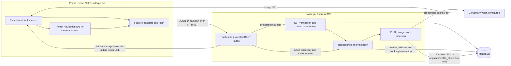

# A3-02 — Implemented system architecture

Repository snapshot: 2026-10-06, after the opening-hours integration. Prepared by Member 1 for Member 3/group review. This describes the running code, with unfinished flows identified separately; it is not a final deployment or acceptance record.

## Runtime components



The phone never connects directly to MongoDB or receives database/Cloudinary secrets. `EXPO_PUBLIC_API_BASE_URL` points to the Express base URL ending in `/api/v1`. Expo/Metro serves the development app bundle; it is separate from the backend. For Expo Go on a phone, the configured host must be reachable from that phone. `localhost` on the phone refers to the phone. [Run/setup instructions](../PATIENT_FLOW_TESTING.md).

The backend reads `apps/api/.env`, connects to MongoDB, ensures indexes and injects repositories into the Express application. `/health` checks database connectivity, but does not prove transaction capability, Cloudinary readiness or successful phone connectivity. Booking checks transaction capability before it writes. [Startup](../../apps/api/src/server.js), [configuration](../../apps/api/src/config/env.js), [app composition](../../apps/api/src/app.js).

## Mobile and API boundaries

| Area | Current implementation | Code |
| --- | --- | --- |
| Startup/navigation | Startup returns signed out; sign-in provides the session in memory. Patient and staff stacks are separate. Identity changes reset navigation history. Guest discovery is available, with booking gated by sign-in. | [App](../../apps/mobile/src/App.tsx), [startup loader](../../apps/mobile/src/features/startup/loadStartupSession.ts), [root navigator](../../apps/mobile/src/navigation/AppNavigator.tsx) |
| Public discovery | `GET /api/v1/hospitals`, `/:hospitalId`, `/:hospitalId/services`, `/:hospitalId/sessions`; active records, validated filters/IDs and public projections. Details includes optional opening hours. | [Hospital routes](../../apps/api/src/modules/hospitals/hospitalRoutes.js), [details adapter](../../apps/mobile/src/features/hospitals/hospitalDetails.ts) |
| Patient authentication | `POST /api/v1/auth/patient/register` and `/login`. NIC/password login returns a signed JWT and patient summary. | [Auth routes](../../apps/api/src/modules/auth/patientAuthRoutes.js), [patient login](../../apps/api/src/modules/auth/patientLogin.js) |
| Booking | `POST /api/v1/bookings`, `GET /api/v1/bookings/me`, `GET /api/v1/bookings/:bookingId`. All require an active patient and enforce ownership. Saved reads power confirmation, Home, My Bookings and booking-alert navigation. | [Booking routes](../../apps/api/src/modules/bookings/bookingRoutes.js), [patient navigator](../../apps/mobile/src/navigation/PatientNavigator.tsx) |
| Notifications | `/api/v1/notifications` provides owned list, mark-read/read-all and delete operations. Booking creation produces its confirmation notification within the transaction. | [Notification routes](../../apps/api/src/modules/notifications/g_notificationRoutes.js), [booking event](../../apps/api/src/modules/bookings/bookingNotification.js) |
| Staff | `/api/v1/staff/auth` registration/sign-in, `/staff/dashboard` reads and `/staff/priority-requests` list/details/decision routes exist. The staff session list/editor remain navigation placeholders. | [Staff navigation](../../apps/mobile/src/navigation/StaffNavigator.tsx), [dashboard](../../apps/api/src/modules/staff/g_staffDashboard.js), [priority routes](../../apps/api/src/modules/priority/g_priorityRoutes.js) |
| Profile/media | Protected `/api/v1/me` reads/updates/preferences and profile-image upload/delete. Cloudinary when configured, otherwise files in `apps/api/profile_photo` with only the link in MongoDB. Fallback reads use `/api/v1/media/profile-photos/:name`. | [Profile routes](../../apps/api/src/modules/users/g_profileRoutes.js), [media adapter](../../apps/api/src/modules/media/g_fileMediaStore.js) |

Protected routes verify the JWT signature, issuer, audience, timestamps and subject using `jose`, then load the current user's role/status from MongoDB. Token claims or client-supplied identity are not the authority for booking. Role/ownership checks follow authentication. Missing/inactive hospitals are indistinguishable to public discovery; cross-patient booking reads cannot reveal another patient's saved booking. [Authentication middleware](../../apps/api/src/middleware/auth.js), [booking detail reader](../../apps/api/src/modules/bookings/bookingDetails.js).

## Booking transaction sequence

```mermaid
sequenceDiagram
  actor Patient
  participant App as Mobile app
  participant API as Express API
  participant DB as MongoDB replica set
  Patient->>App: Select service and future session; confirm
  App->>API: POST /bookings {sessionId} + Bearer JWT
  API->>API: Validate JWT, body and patient role
  API->>DB: Check current account and transaction capability
  API->>DB: Begin transaction
  API->>DB: Recheck active patient, hospital and service
  API->>DB: Reject existing patient/session booking
  API->>DB: Validate session; conditionally increment bookedCount
  API->>DB: Insert unique booking and unread confirmation notification
  alt All checks and writes succeed
    API->>DB: Commit
    API-->>App: 201 with persisted booking ID and code
    App->>API: GET /bookings/:bookingId + Bearer JWT
    API->>DB: Read patient-owned booking and linked details
    API-->>App: Saved summary
    App-->>Patient: Display confirmation and saved details
  else Check or write fails
    API->>DB: Roll back provisional writes
    API-->>App: Structured error
    App-->>Patient: Show failure or recovery guidance
  end
```

This diagram groups validation steps for readability. The driver may retry a transaction after a transient conflict; the callback only performs database work. Capacity increment, booking insert and notification insert commit together. Unique indexes cover `(patientId, sessionId)` across all booking statuses and `bookingCode`; a partial notification index prevents duplicate booking-confirmed events. A cancelled booking therefore still prevents another booking for the same patient/session under the current rule. [Booking repository](../../apps/api/src/modules/bookings/bookingRepository.js), [notification producer](../../apps/api/src/modules/bookings/bookingNotification.js).

If the HTTP response is lost after commit, the mobile app cannot infer failure or success from that loss alone. It shows recovery guidance instead of automatically creating another booking. The database uniqueness constraint still guards repeated submissions. [Submission hook](../../apps/mobile/src/features/booking/useBookingSubmission.ts).

## Stored relationships and refresh behavior

The core booking references are `opdServices.hospitalId → hospitals._id`, `opdSessions.hospitalId/serviceId → hospitals/opdServices`, and `bookings.patientId/sessionId → users/opdSessions`. Notification ownership is `notifications.userId`; a booking event carries `data.bookingId` and `data.sessionId`. These are ObjectId references checked by application logic, not SQL foreign keys. The optional `hospitals.openingHours` field is display text and does not control capacity or session eligibility.

Existing staff modules also read `priorityRequests`, `queueEntries` and write audit/notification data. Their presence does not establish that patient priority submission, check-in and call-next journeys are connected. Full collection definitions remain in [README section 13](../../README.md#13-database-model).

The shared focused-screen resource hook runs an initial read and optional interval refresh. It aborts requests and clears the timer on navigation blur/unmount, and retains the last successful data on a failed background read. Current intervals are 10 seconds for the staff dashboard/priority inbox and 15 seconds for Alerts. Member 1 discovery and booking screens use their own focus/retry/refresh hooks; the 30-second local clock update on session selection is not a 30-second API poll. Patient queue polling remains pending. [Shared refresh hook](../../apps/mobile/src/api/g_useApiResource.ts), [session hook](../../apps/mobile/src/features/booking/useAvailableSessions.ts).

## Validation and outstanding integration

Real HTTP/MongoDB tests verify booking capacity, duplicates, rollback, ownership, authentication and the connected registration-to-booking journey. App tests use real forms/navigation with simulated HTTP. The most recent recorded checks are 82 API tests, 291 mobile tests, TypeScript, lint and Android/iOS bundle exports passing; these are prior implementation results, not a new run for this document. [Evidence and commands](../TESTING.md).

The following remain outside completed acceptance: persistent session restoration, patient cancellation/rescheduling/priority backend integration, staff session editor and full queue operations, final Cloudinary configuration, physical Expo Go/accessibility testing, participant usability evidence and an installable release build. The original verification-code flow also differs from the current active-account registration behavior. See [stack tradeoffs](TECH_STACK.md) and [project status](../DEVELOPMENT_PLAN.md).

Member 3/group architecture review is pending. A3-02 must be checked again against the final merged release before being described as the final architecture.
